**Cours 1.**

**Les '==' dans le PDF sont à ignorer pour l'instant, ils permettent du surlignage en markdown.**

<!-- PRESET POUR LE GRAPHVIZ

Toutes les listes et piles seront représentées comme suit :

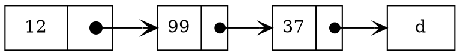

 -->

# Introduction

**Objectif principal :** Comment définir des structures de données et des algorithmes pour les manipuler efficacement ?

$\rightarrow$ Une structure de données est un objet qui permet de stocker des informations et de faire des requêtes sur ces informations.

### Exemple

Un éditeur de texte : manipuler une chaine de caractères.

*Note : on ne parle pas du rendu visuel*

Définition abstraite :

- Insérer une chaîne de caractères à un endroit
- Supprimer une chaîne de caractères à un endroit
- Rechercher une chaîne de caractères dans un texte
- Rechercher une chaîne de caractères / un sous mot dans un texte
- Mise en page visuelle
  - Chaque caractère a un certain nombre d'attributs (couleur, police, taille, etc.)

Lors de l'étape de la programmation il faut que cette définition abstraite devienne concrète dans la machine en utilisant les constructions du langage de programmation. Tout cela va constituer la structure de données de l'éditeur de texte : c'est **l'implémentation**.

#### Détails

Une manière de faire :

- structure en `C` pour représenter un caractère et ses attributs
- l'objet pour stocker les caractères est un tableau de caractères

Structure de données concrète pour éditeur de texte ici sera : ce tableau ainsi que les fonctions qui permettent de manipuler ce tableau (`lire`, `ecrire`, `inserer`, `supprimer`, `rechercher`, etc.).

*En java, le constructeur classe encapsule les différentes fonctions manipulant le tableau de caractères.*

#### Remarque

- Une modification de caractère revient à supprimer un caractère et à insérer un autre caractère. Donc la question de la complétude de la structure de données des opérations proposées se pose pour chaque chaque structure de données.

**Complétude** : Est-ce que tout les comportements voulus sont définis par les opérations proposées ?


- Pour être sûr que la fonction implémentée est correcte, on décrit un "bon comportement" en langage mathématique. On peut ensuite vérifier que la fonction implémentée correspond bien à ce comportement à l'aide d'une preuve (exemple : récurrence). Ensuite, pour chaque implémentation, on montre que l'implémentation respecte la spécification.


#### Retour sur les détails

Est-ce que c'est une bonne implémentation ?

- Bonne par rapport à quoi ? On définit des objetifs (par exemple une fonction associant à chaque implémentation une valeuret notre objectif sera une certaine valeur).
  - Exemple complexité en temps (grosso modo temps d'execution)
  - Complexité en mémoire (espace en mémoire auxiliaire utilisée)


|                                                Temps d'execution                                                |                                                Mémoire utilisée                                                |
|:---------------------------------------------------------------------------------------------------------------:|:--------------------------------------------------------------------------------------------------------------:|
|                    🛑 `ajouter` / `supprimer` (on va devoir décaler les caractères suivants)                    | Mémoire ? Comment on gère ?  Si on utilise la structure de données avec tableau dynamique, c'est un peux mieux |
| 🛑 La `recherche` est lente : on ne peut pas utiliser d'algorithme complexe (le texte n'est pas forcément trié) |                                                                                                                |

## Langage de description

- Langage usuel pour décrire des structure de données avec de temps en temps des notations mathématiques ou constructions mathématiques (que vous avez déjà vues)
- Pour expliquer une implémentation d'une structure de données :
  - La description d'étapes élémentaires (basée sur le cours d'Alhorithmique)
  - De temps en temps du pseudo-code est équivalent au mélange de `C` et de pseudo-code vu en L1. 


# Chapitre 1 : Algorithmique, Types, Valeurs

- **Algorithme** : Suite d'opérations en vue de résoudre un prolbème.
  - Un algorithme a des entrées, et produit une sortie (réponse à la question)
  - Un algorithme manipule des données
  - Chaque opération est définie par un nom et une description
    - Ces **données** on les classifie par rapport aux opérations possibles : c'est ce que l'on appelle le typage
    - L'encodage des données produit un ensemble de **valeurs**


**Cours 2.**

On va classifier les types : chaque type est identifié par un ensemble de valeurs, et l'ensemble des opérations possibles sur les valeurs. Une classe sera un type.

- Une constante est une valeur particulière pour ce type.
- Une variable va représenter des valeurs possibles pour ce type.
  - Faire la distinction entre la variable et le contenu (la variable est l'ensemble des valeurs possibles pour ce type, le contenu est une valeur de ce type)

## Les types

Il y a deux types de types :

- Les ==types primitifs==
- Les ==types composés==

### Types primitifs

Ils sont non décomposables et fournis par défaut.
Dans ce cas les type primitifs sont entiers, réels, carctères, booléens, chaînes de caractères.

### Types composés

Ils sont construits à partir d'autres types : 3 constructeurs de types :

- *Produit* : $T_1,T_2,...,T_m$ sont des types, alors $T_1\times T_2\times...\times T_m$ est un type avec comme valeurs les couples $(v_1,v_2,...,v_m)$ où $v_i$ est une valeur de $T_i$.
- *Somme* : $T_1,T_2,...,T_m$ sont des types, alors $T_1\oplus T_2\oplus...\oplus T_m$ est un type avec comme valeurs les couples $(v_1,v_2,...,v_m)$ où $v_i$ est une valeur de $T_i$.
  - **Exemple** : les constructeurs `union` en C
- *Enregistrements* : chaque valeur d'un enregistrement est composé de plusieurs entités, appelées **champs**, chacun ayant un identifiant, un type et une valeur.
  - **Exemple** : les constructeurs `struct` en `C`, ou encore `class` en `Java`
- *Constructeur de tableau* : Un tableau est un ensemble contigu de valeurs où on a accès en temps constant à chaque valeur. Dans la plupart des implémentations de tableau toute les valeurs ont le même type.
  - Pour réserver de la place mémoire pour un tableau de taille $n$, et la taille d'une valeur c'est $p$, on réserve $n\times p$ octets bits. Si adresse de début c'est $adr_0$, alors pour accéder à l'indice $0\leq i \leq n-1$ :

$$i\times p +adr_0 \text{ (opération constante)}$$


# Chapitre 2 : Types de données abstrait

## Définition 2.1 : Types de données abstrait

Un ==type de données abstrait (TDA)== est un type de données composé, dont on définit :

- Une **signature** : un identifiant, et type de retour / paramètres de chaque opération et d'un ensemble de types prédéfinis à utiliser.
- Une **liste d'axiomes** qui vont définir le comportement des opérations sur des valeurs du TDA.

### Exemple

On choisit les entiers. 
- Opérations, addition, soustraction prend deux entiers en paramètres et renvoie un entier.


Pour avoir des ==types de données concrètes (TDC)==, on propose une façon de représenter dans la machine une TDA, en proposant la façon de manipuler cette représentation à travers les opérations du TDA. C'est ce qu'on appelle une ==implémentation d'un TDA==.

### Exemple

- Un TDC : on choisit de représenter les entiers par des nombres binaires en représentation complément à deux. On va donc implémenter les opérations de base sur les entiers.
- La définition d'un `String` en `C` : on choisit de représenter les chaînes de caractères par des tableaux de caractères. On va donc implémenter les opérations de base sur les chaînes de caractères. C'est un TDA.


## 2.1 : TDA Pile

Le ==TDA Pile== est apparu lorsque l'on a eu besoin de structures, les programmes en blocs que l'on peut référencer (bloc pouvant se référencer).

**Principale question** : comment fournir des données aux blocs référencés et ensuite retourner au bloc appelant ? C'est représenter les références aux blocs dans un SDD (Structure de Données Dynamique) ayant le *même comportement qu'une pile d'assiette*.

### Définition 2.2 : Pile


Les ==différentes opérations== sur une pile sont :

- `creerPile`: $() \rightarrow$ `Pile_T`  : Créer une pile vide
- `estVidePile`: `Pile_T` $\rightarrow$ `Booléen` : Vérifie si la pile est vide
- `empiler`: `Pile_T` $\times$ `T` $\rightarrow$ `Pile_T` : Empile un élément sur la pile
- `depiler`: `Pile_T` $\rightarrow$ `Pile_T` : Dépile un élément de la pile
- `sommetPile`: `Pile_T` $\rightarrow$ `T` : Renvoie le sommet de la pile

==Axiomes== : 

- `estVidePile(creerPile()) = True`
- `estVidePile(empiler(p, x)) = False`
- `sommetPile(empiler(p, x)) = x`
- `depiler(empiler(p, x)) = p`

Le TDA `T` est utilisé pour dire que la pile on l'utilise pour stocker que des objets du même type. On ne fait aucune supposition sur `T`, à part les valeurs de T existent.

#### Implémentation possible

On utilise un tableau pour stocker les valeurs et un entier qui va pointer sur l'indice du sommet de pile.

En `C` :

```c
struct pile {
    int T[MAX];
    int sommetPile;
};
```

Ici, `sommetPile` permet de savoir où l'on doit poser le sommet de la pile. On peut donc empiler et dépiler en temps constant (au lieu de chercher l'élément le plus en bas de la pile).

### Le TDA File

Le besoin : gestion des accès à des ressources limitées ou pour éviter les accès concurrents.

**==Paradigme==** : Premier arrivé, premier servi.

#### Description du TDA

Le TDA `File_T` est un TDA composé de :

- `creerFile`: $() \rightarrow$ `File_T` : Créer une file vide
- `estVideFile`: `File_T` $\rightarrow$ `Booléen` : Vérifie si la file est vide
- `enfiler`: `File_T` $\times$ `T` $\rightarrow$ `File_T` : Enfile un élément dans la file
- `defiler`: `File_T` $\rightarrow$ `File_T` : Défile un élément de la file
- `teteFile`: `File_T` $\rightarrow$ `T` : Renvoie le premier élément de la file

==Axiomes== :

- `estVideFile(creerFile()) = True`
- `estVideFile(enfiler(f, x)) = False`
- `teteFile(enfiler(f, x)) = x`
- `defiler(enfiler(f, x)) = f`
- `defiler(enfiler(enfiler(f, x), y)) = enfiler(f, y)`

#### Implémentation possible

On peut représenter une file par un tableau et deux entiers : 

- Tête qui point sur l'indice de la tête de file
- Queue qui pointe sur l'indice de la queue de la file

En `C` :

```c
struct file {
    int T[MAX];
    int tete;
    int queue;
};
```

Pour un fil, comme c'est un ensemble ordonné : on doit toujours connaître l'ordre de la file, ce qui va permettre de défiler et d'enfiler en temps constant.


##### Exemple de File

<!-- Suivre les presets vu au dessus pour les piles et files -->
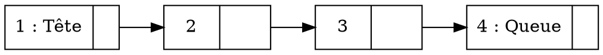

On défile la tête de la file, on décale la tête de la file vers la droite.


<!-- On met en rouge la tête -->
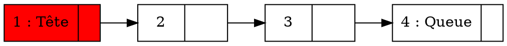

On obtient donc :

<!-- On défile, et on met en vert foncé la nouvelle tête -->
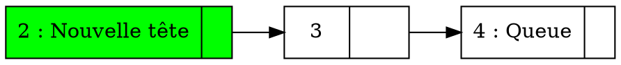

La file est stockée dans un intervalle de tableau, on peut donc décaler la tête de la file en temps constant.

Par contre on n'arrive pas à distinguer File vide de tableau Plein.

$\rightarrow$ Ce n'est pas insurmontable :

- Compter le nombre d'éléments
- Garde une case vide entre queue et tête
- ...


<!-- Les notes du cours précédent arriveront bientôt, j'étais absent -->


# Cours du 20 février


# Chapitre 4 : TDA Listes

**Idée** : On ne veut pas stocker les éléments dans un espace contigu (on n'a ==pas souvent assez de place==).

## Définition

Une *liste* est un ==ensemble ordonné==, et on a accès qu'au premier élément. À partir du premier élément, on peut accéder au deuxième, puis depuis le deuxième, on peut accéder au troisième, etc.

C'est un ensemble ordonné avec la ==fonction `successeur`==.

## Implémentation classique

L'implémentation classique se fait avec des listes chaînées : 

- Chaque élément de la liste est un maillon
- Chaque maillon contient une valeur et un pointeur vers le maillon suivant

En C :

```C
struct maillon {
    T data;
    struct maillon *suivant;
};
```


### Description du TDA `Cellule_T`


Le TDA `Liste_T` va utiliser le TDA de `cellule_T` :

- `creerCellule`: $() \rightarrow$ `cellule_T` : Créer une cellule vide
- `valeurCellule`: `cellule_T` $\rightarrow$ `T` : Renvoie la valeur de la cellule
- `suivantCellule`: `cellule_T` $\rightarrow$ `cellule_T` : Renvoie le maillon suivant (une référence)


Les cellules sont utilisées pour représenter les éléments d'une liste.

Dans une cellule on a deux informations : 

- Une valeur à stocker
- Une référence à une autre cellule (qui peut être vide indiquant la fin de la liste)

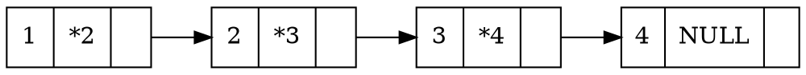

Ici, `*2` est une référence à la cellule `2`.

Pour faciliter la manipulation des cellules, on peut ajouter des fonctions de modifications :

- ==Modifier la valeur== de la cellule
- ==Modifier la référence== de la cellule

### Exemple d'implémentation

```ruby
Enregistrement cellule1 {
    T valeur;
    int pC;
}

Enregistrement cellule2 {
	T valeur;
	cellule2 pC;
}
```

*Note : `Enregistrement` est l'équivalent de `struct` en `C`*

### Opérations sur les listes

- `creerListe`: $() \rightarrow$ `Liste_T` : Créer une liste vide
- `estVide`: `Liste_T` $\rightarrow$ `bool` : Vérifie si la liste est vide
- `teteListe`: `Liste_T` $\rightarrow$ `T` : Renvoie la tête de la liste
- `taille`: `Liste_T` $\rightarrow$ `int` : Renvoie la taille de la liste

Les fonctions d'insertion à des rangs fixes :

- `insererTete`: `Liste_T`, `T` $\rightarrow$ `Liste_T` : Insère un élément en tête de liste
- `insererQueue`: `Liste_T`, `T` $\rightarrow$ `Liste_T` : Insère un élément en queue de liste

Fonction d'insertion à un rang donné :

- `insererPosition`: `Liste_T`, `T`, `int` $\rightarrow$ `Liste_T` : Insère un élément à une position donnée

Pour $(l,x,i)$ on veut que l'élément $x$ soit inséré à la position $i$.

#### Exemple :

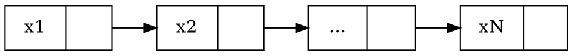

Avec $i = 2$ :

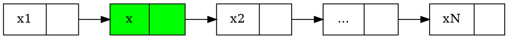

Les fonctions pour supprimer des éléments :

- `supprimerTete`: `Liste_T` $\rightarrow$ `Liste_T` : Supprime la tête de la liste
- `supprimerQueue`: `Liste_T` $\rightarrow$ `Liste_T` : Supprime la queue de la liste

Fonction pour supprimer un élément à une position donnée :

- `supprimerPosition`: `Liste_T`, `int` $\rightarrow$ `Liste_T` : Supprime un élément à une position donnée

#### Exemple :

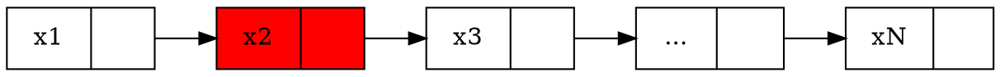

Avec $i = 2$ :

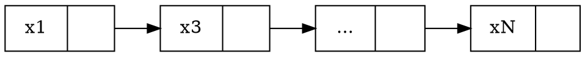

- `queue`: `Liste_T` $\rightarrow$ `Liste_T` : Supprime la tête de la liste (renvoie la liste sans la tête)

## Implémentation TDA Liste

On va prendre l'implémentation par listes chaînées : on va représenter une liste par une référence vers la tête de la liste.

```ruby
Enregistrement liste {
	cellule l;
}
```

- Une première implémentation, une cellule est représentée par un index dans un tableau
  - Les éléments de la liste sont stockés à ce qui ressemble à un tableau

**Question** : Où se trouve la cellule référencée ?

- De façon implicite : on considère que c'est l'indice suivant
  - Dans ce cas, les indices sont stockés dans un intervalle fermé $[0, n-1]$
- De façon explicite : chaque cellule va contenir un pointeur vers la cellule suivante
  - Une cellule : 2 entiers (un index et un pointeur vers la cellule suivante) et la valeur de l'élément

On stock des éléments de la liste dans un tableau de cellules. Pour cette implémentation, il faut la notion de cellule `NULL`.

Insérer revient à demander l'index d'une cellule libre pour l'utiliser pour stocker le nouvel élément (et en refaisant le chaînage si besoin).

On va stocker un tableau de cellules qui va avoir : 

- la valeur de l'élément
- un pointeur vers la cellule suivante

```ruby
Enregistrement cellule {
  T val;
  cellule suiv;
}
```

Et on a un tableau de cellules :

```ruby
Enregistrement liste {
  cellule tab[100];
  int tete;
  int taille;
}
```

<!-- Ajout du 24 février 2023 -->


### Exemple

<!-- Faire un tableau de cellules qui contient des cases vides et des cases pleines (avec une donnée et un pointeur) 

Les cellulles vides sont en rouge
-->
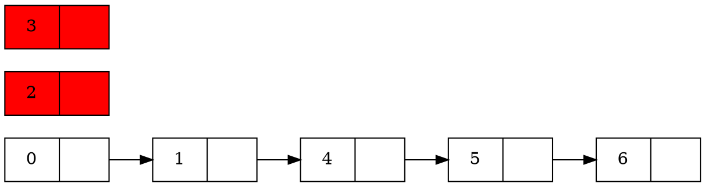

Les cases vides sont en rouge.


On essaye de distinguer les cases vides avec des cases pleines avec des valeurs spéciales (ex : -1).

Il a le ==suivant logique== et le ==suivant spacial== (le suivant logique est le suivant dans la liste, le suivant spacial est le suivant dans le tableau).

**Ajout possible** : On peut rajouter une pile qui contient les cases libres du tableau.

## Quand utiliser les listes

On utilise les listes pour représenter les ensembles car on ne connaît pas d'avance la taille de ses ensembles. 

- Insertion début : `a` :
  - On demande à `p` 1 case : `p` renvoie 0
  - On stock `a` dans `tab[0].v`
  - On stock LD dans `tab[0].s`
  - On stock dans LD : 0
- Insertion en fin `c` : 
  - On demande à `p` 1 case : `p` renvoie 1
  - On stock `c` dans `tab[1].v`
  - On stock -1 dans `tab[1].s`
- Supprimer en début : 
  - On stock LD dans `p`
  - Dans LD on stock `tab[LD].s`
- Insérer `b` en fin
  - `p` renvoie 0


# Exemple d'analyse de complexité

Graphe : $G:(V,E), V:$ ensemble de sommets. $E\subset V\times V$ relation binaire.

```ruby
PP(G: graphe, r: sommet) {
  	colorie r en gris
  	Pour chaque voisin blanc : v de r Faire {

		PP(G, v)

  	}
	colorie r en noir
}
```

==Definition== : 

- $w$ est un voicin de $v$ si $(v,w)\in E$
- Chaque sommet a une couleur : blanc, gris ou noir

Avec l'algo $PP$ on a au moins 4 opérations

- Connaître la couleur d'un sommet
- Modifier la couleur d'un sommet
- Créer un graphe
- Connaître l'ensemble des voisins d'un sommet
- Accéder à un sommet

On modifie le programme comme suit :

```ruby
PP(G: graphe, r: sommet, T: graphe) {
  	colorie r en gris
  	Pour chaque voisin blanc : v de r Faire {

		ajouter à E(T) la pair (r,v)
		PP(G, v)

  	}
	colorie r en noir
}
```


On doit rajouter les opérations suivantes :

- Ajouter une arête

| Opération | Complexité |
| --- | --- |
| 1. Tableau de taille n : les indices représentant les sommets et les valeurs les couleurs | Un tableau de taille $n$ (indices représentant les sommets) et chaque case contient 2 champs : La couleur, une liste contenant la liste des voisins |
| Matrice booléenne de taille $n\times n $ : case $(i,j)=1 \leftrightarrow  (i,j)$ est une arrête  | |
| Matrice d'adjacence taille : $n^2 + n$ | taille : $O(n+n)$ |

<!-- Cours du 3 mars -->

- Connaître la liste des voisins de $i$  :
  - Parcourir la ligne $i$ de la matrice d'adjacence
  - Si la case est à 1, alors $i$ est un voisin de $j$ (ajouter $j$ dans un ensemble)

```ruby
Pour j de 0 à n-1 Faire {
  Si mat[i][j] = 1 Alors {
    Ajouter j à la liste des voisins de i
  }
}
```

==Complexité== : $O(\text{nombre de voisins de }i \times \text{ complexité d'ajout dans }L) + O(n-\text{ nombre de voisins})$

- Suivant le type de $L$,
  - $L$ est une pile avec empiler en $O(1)$ et dépiler en $O(1)$
    - $O(\text{nombre de voisins de }i \times 1) + O(n-\text{ nombre de voisins}) = O(n)$
  - $L$ est un file avec enfiler en $O(1)$ et défiler en $O(1)$
    - $O(\text{nombre de voisins de }i \times 1) + O(n-\text{ nombre de voisins}) = O(n)$
  - Si $M$ est une liste avec insertion début en $O(1)$, pareil que pile / file si on insère au début
  - Si $L$ est liste et on fait une inseertion en fin, qui a une compleité en temps $O(m)$.
  - SI $L$ est une liste et on fait une insertion en fin qui a une complexité en temps $O(m)$ :

$$\sum_{j \text{ pas de voisin de }i}O(1) + \sum_{j \leq j \leq \text{nombre de voisins}}O(j) = O(n - \text{nombre de voisins} + \text{nombre de voisins}^2)$$

### Matrice d'incidence
  
- Ajouter une arête : $(i,j)$
  - Ajouter à la ligne $T[i]$ la valeur $j$ :
    - $O(1)$ si au début
    - $O(n)$ si à la fin
    - La complexité dépend de la fonction d'ajout
- Connaître l'ensemble des voisins de $i$ :
  - retourner la ligne $T[i]$
- On estime la complexité de $PP$ 

### Complexité de `PP(G, r, T)`

#### Trace srur un exemple

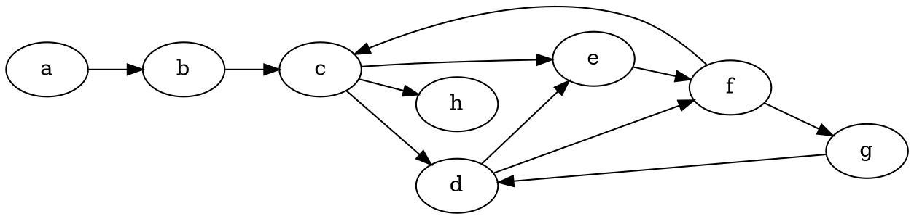

Supposons `r = c`.

- $T = (\{c,d\}, \{c\rightarrow d\}), c \text{ colorié gris}$

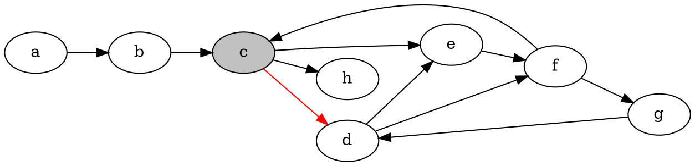

- $PP(G,d,T)$ : voisins blancs de $d$ : $\{e,f\}$
  - $T$ vaudra : $(\{c,d,e\}, \{c \rightarrow d, d\rightarrow e\})$

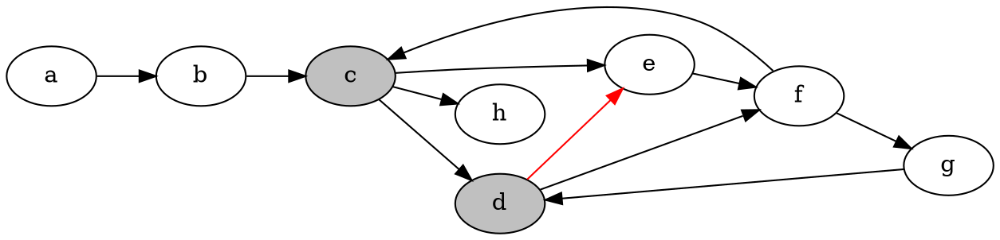

- $PP(G, e, T)$ : $e$ colorié gris, voisins blancs de $e$ : $\{f\}$
  - $T$ vaudra : $(\{c,d,e,f\}, \{c \rightarrow d, d\rightarrow e, e\rightarrow f\})$

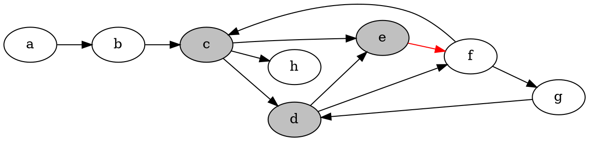

- $PP(G, f, T)$ : $f$ colorié gris, voisins blancs de $f$ : $\{g\}$
  - $T$ vaudra : $(\{c,d,e,f,g\}, \{c \rightarrow d, d\rightarrow e, e\rightarrow f, f\rightarrow g\})$

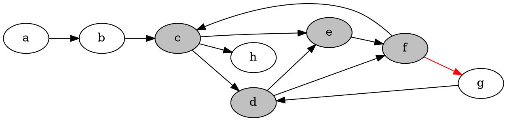

- $PP(G, g, T)$ : $g$ colorié gris, voisins blancs de $g$ : rien. Donc on colorie $g$ en noir.
  - On sort de la boucle `Pour`, finit et retourne à l'appelant : `PP(G, f, T)`

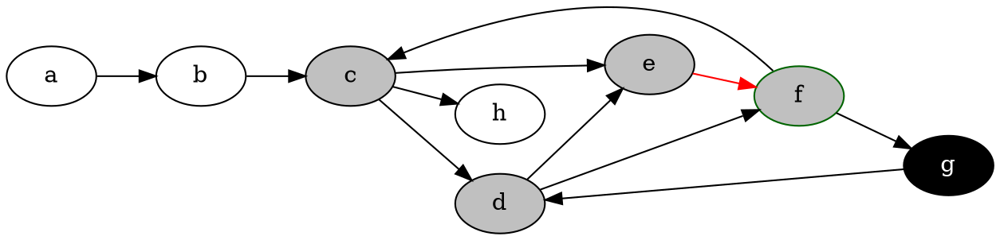
- $PP(G, f, T)$ : $f$ colorié gris, il n'a plus de voisins blancs. On colorie $f$ en noir.
  - On sort de la boucle `Pour`, finit et retourne à l'appelant : `PP(G, e, T)`

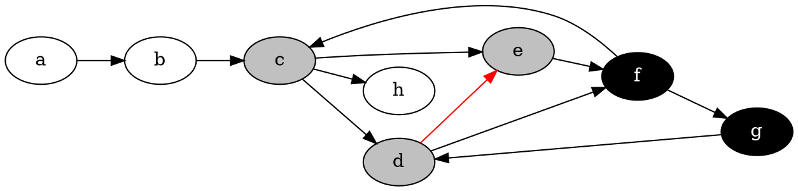

- $PP(G, e, T)$ : $e$ colorié gris, il n'a plus de voisins blancs. On colorie $e$ en noir.
  - On sort de la boucle `Pour`, finit et retourne à l'appelant : `PP(G, d, T)`

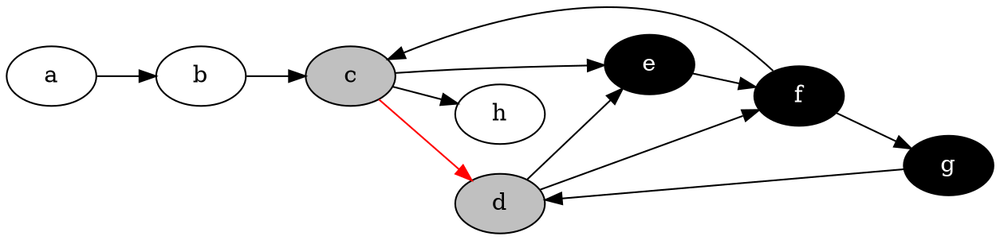

- $PP(G, d, T)$ : $d$ colorié gris, il n'a plus de voisins blancs. On colorie $d$ en noir.
  - On sort de la boucle `Pour`, finit et retourne à l'appelant : `PP(G, c, T)`

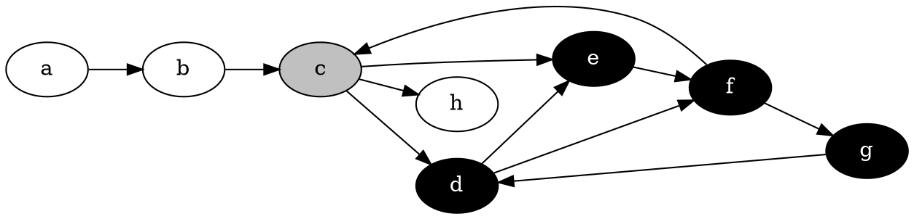

- $PP(G, c, T)$ : $c$ colorié gris, on a $h$ en blanc. On colorie $h$ en gris.
  - $T$ vaudra : $(\{c,d,e,f,g,h\}, \{c \rightarrow d, d\rightarrow e, e\rightarrow f, f\rightarrow g, c\rightarrow h\})$

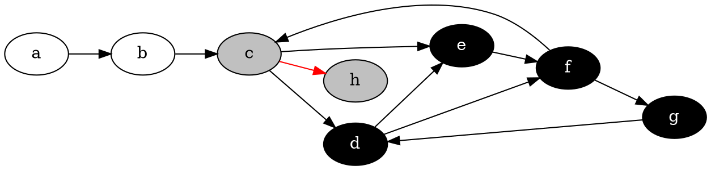

- $PP(G, h, T)$ : $h$ colorié gris, il n'a plus de voisins blancs. On colorie $h$ en noir.
  - On sort de la boucle `Pour`, finit et retourne à l'appelant : `PP(G, c, T)`

```dot
digraph {
  rankdir=LR;
  a -> b;
  b -> c;
  c -> d;
  c -> e;
  d -> e;
  e -> f;
  f -> g;
  g -> d;
  f -> c;
  c -> h;
  d -> f;
  c [fillcolor=gray, style=filled];
  d [fillcolor=black, style=filled, fontcolor=white];
  e [fillcolor=black, style=filled, fontcolor=white];
  f [fillcolor=black, style=filled, fontcolor=white];
  g [fillcolor=black, style=filled, fontcolor=white];
  h [fillcolor=black, style=filled, fontcolor=white];
}
```

- $PP(G, c, T)$ : $c$ colorié gris, il n'a plus de voisins blancs. On colorie $c$ en noir.
  - On sort de la boucle `Pour`, finit et retourne à l'appelant : `PP(G, b, T)`

```dot
digraph {
  rankdir=LR;
  a -> b;
  b -> c;
  c -> d;
  c -> e;
  d -> e;
  e -> f;
  f -> g;
  g -> d;
  f -> c;
  c -> h;
  d -> f;
  c [fillcolor=black, style=filled, fontcolor=white];
  d [fillcolor=black, style=filled, fontcolor=white];
  e [fillcolor=black, style=filled, fontcolor=white];
  f [fillcolor=black, style=filled, fontcolor=white];
  g [fillcolor=black, style=filled, fontcolor=white];
  h [fillcolor=black, style=filled, fontcolor=white];
}
```

On est revenu à l'appelant de `PP(G, a, T)`, on a donc fini. On a fini d'explorer le graphe, on a donc fini l'algorithme.

==Borner la complexité de cet algo== : c'est borner le nombre le nombre  d'appels récursifs et ensuite sommer la complexité de chaque appel récursif.

La complexité d'un appel $PP(G, x, T)$ : si on oublie les appels récursifs, on a :

- Calculer au les voisins de $x$
- Parcourir les voisins de 1 à 1 et si le voisin $y$ est blanc, ajouter 1 arrête à $T$
- Chaque sommet $x$, on fait au maximum un appel récursif $PP(G, x, T)$ car la première chose que fait $PP(G, x, T)$ est de colorier $x$ en gris
- Il suffit donc de compter les sommets coloriés gris, qui sont exactement les sommets dans $T$ : c'est exactement les sommets accessibles depuis $x$

$x$ est accessible depuis $r$ si $\exists x_0, x_1, \ldots, x_n$ avec $x_0 = r$ et $\forall 0 \leq i \leq n-1$, il existe une arrête $(x_i, x_{i+1})$.

==Complexité de $PP(G, \land, \phi)$ :

$$\sum_{x \text{ accessible depuis }r}\text{Complexité boucle pour parcourir les voisins de }x$$

$\rightarrow$ Si matrice d'adjacence et pile pour stocker les voisins :

$$\sum_{x \text{ accessible depuis }\land} O(n) = O(n \times Z) \text{, $Z$ le nombre de sommets accessibles}$$

$$\sum_{x \text{ accessible depuis } r}O(nbVoisins(x)) \leq \sum_{x \text{ sommet }}O(nbVoisins(x))$$

$$\leq O(m+n) \text{, $m$ le nombre d'arrêtes, $n$ le nombre de sommets}$$