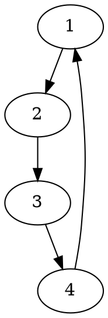

# Exercice 0.2

## 1.

Une méthode pour représenter les permutations de $\{0,...,n\}$ est avec une structure de données.

## 2.

On veut une fonction qui calcule $f\circ g$, avec $f$ et $g$ des permutations de $\{0,...,n\}$.

```ruby
Func int[] compose(int[] f, int[] g, int n):

    int resultat[n]

    Pour i allant de 0 à n-1:

        resultat[i] = f[g[i] - 1]
    
    retourner resultat
```

## 3.

On veut générer tout les cycles d'une permutation.

Exemple de cycle $\{2,3,4\}$ : 




```ruby
Func int[][] cycles(int[] f, int n):

    int[n][n] C # On initialise à 0 le cycle
    boolean[n] p # Initialiser à Faux

    Tant qu il existe x tq p[x - 1] == Faux:
        int j = 0
        
        C[x - 1][j] = x
        p[x - 1] = Vrai

        int y = f[x - 1]

        Tant que y !=:
            p[y - 1] = Vrai
            j = j + 1
            C[x - 1][j] = y
            y = f[y - 1]

    retourner C
```

# Exercice 0.3

## 1.

Pour représenter les polynômes à une variable de degré $n$ ($f(x) = a_0 x^0 + ... + x^n$), on peut utiliser un tableau qui va stocker $n$ valeurs ($a_0, ..., a_{n-1}$). On suppose que le coefficient dominant $a_n=1$.

## 2.

Pour effectuer $f(x)$ :


```ruby
Func int f(int x, int[] f, int n):
    int somme = 0

    Pour i allant de 0 à n-1:
        somme = somme + f[i] * x ** i # On admet que x**i est défini (fonction puissance)
    
    retourner somme
```

## 3.

Pour effectuer $(f + g)$ :

```ruby
Func int[] sommeFunc(int [] f, int nF, int[] g, int nG):
    int[] h

    Si nF < nG:
        int[] funcMin = f
        int[] funcMac = g
        int tailleMin = nF
        int tailleMax = nG
    
    Sinon:
        int[] funcMin = g
        int[] funcMac = f
        int tailleMin = nG
        int tailleMax = nF

    Pour i allant de 0 à tailleMax - 1:

        Si i < tailleMin:
            h[i] = funcMin[i] + funcMax[i]

        Sinon:
            h[i] = funcMax[i]

    retourner h
```