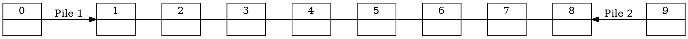
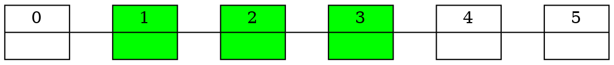
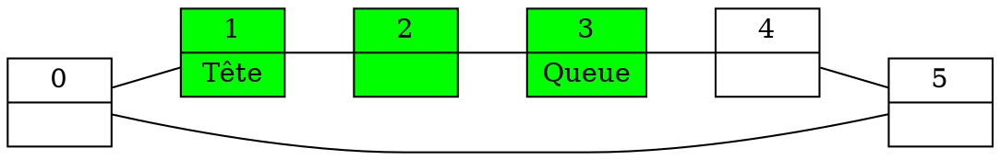

# 1.3

## 1.

On se donne un TDA `2Piles`. On manipule deux piles.

On doit implémenter cela avec un tableau.

<!-- Fait un tableau à 10 cases en graphviz -->



On a une pile qui part du début du tableau et une qui part de la fin.

Pseudo-code des opérations :

```ruby
Func 2Piles creerPile(int n) {
    int[] tab = new int[n]
    int p1 = 0
    int p2 = n
    return 2Piles(tab, p1, p2)
}

Proc empiler1(2Piles p, int x) {

    Si p.p1 == p.p2 {
        Afficher("Tableau Plein")
        return
    }

    p.tab[p.p1] = x
    p.p1 = p.p1 + 1
}

Proc empiler2(2Piles p, int x) {
    
    Si p.p1 == p.p2 {
        Afficher("Tableau Plein")
        return
    }
    
    p.tab[p.p2] = x
    p.p2 = p.p2 - 1
}

Func int depiler1(2Piles p) {

    Si estVide(p) {
        error("Pile vide")
    }

    p.p1 = p.p1 - 1
    return p.tab[p.p1]
}

Func int depiler2(2Piles p) {

    Si estVide(p) {
        error("Pile vide")
    }
    
    p.p2 = p.p2 + 1
    return p.tab[p.p2]
}

Func boolean estVide1(2Piles p) {
    return p.p1 == 0
}

Func boolean estVide2(2Piles p) {
    return p.p2 == p.tab.length - 1
}
```

## 2.

```ruby
Func empiler1Vers2(2Piles p) {
    # empiler2(depiler1(p))
    int x = depiler1(p) # On fait en 2 étapes si on a une erreur
    return empiler2(p, x)
}

Proc empiler2Vers1(2Piles p) {
    # empiler1(depiler2(p))
    int x = depiler2(p) # On fait en 2 étapes si on a une erreur
    return empiler1(p, x)
}
```

# 1.4

## 1.

Avec une file avec un tableau, on a un problème quand on dépile : on a un trou à droite du tableau qui ne sera pas rempli.

Exemple :

<!-- Visualiser avec graphviz une liste à 6 éléments, avec les éléments 2 à 3 pleins (en vert) -->



Les éléments 1, 2 et 3 sont remplis. On peut défiler (par la droite), mais à droite on ne pourra plus remplir.

## 2.

```ruby
# On implémente une file avec un tableau circulaire

Enregistrement File {
    int[] tab
    int tete
    int queue
    int MAX
}

Func File creerFile(int n) {
    int[] tab = new int[n]
    int tete = 0
    int queue = 0
    int MAX = n
    return File(tab, tete, queue, MAX)
}

Proc enfiler(File f, int x) {
    Si estVide(f) {
        f.tete = f.queue = 0
        f.tab[f.queue] = x
    } 

    Si nbElements(f) == f.MAX {
        error("File pleine")
    } Sinon {
        f.queue = (f.queue + 1) % f.MAX
        f.tab[f.queue] = x
    }

    return f

}

Func int defiler(File f) {
    Si estVide(f) {
        error("File vide")
    }

    Si nbElements(f) == 1 {
        f.tete = f.queue = -1
    } Sinon {
        f.tete = (f.tete + 1) % f.MAX
    }
}

Func boolean estVide(File f) {
    return f.tete == f.queue
}

Func int nbElements(File f) {
    Si f.tete <= f.queue {
        return f.queue - f.tete
    } Sinon {
        return (f.MAX - f.tete) + f.queue + 1
    }
}
```

Représentation de la file :

<!-- Visualiser avec graphviz une liste à 6 éléments, avec les éléments 2 à 3 pleins (en vert) -->



# 1.5

## 1.

On fait la pile avec deux files.

```ruby
Enregistrement pile = {
    file f1, f2
}
```

Deux possibilités :

- Les éléments de la piles ont toujours dans la file `f1`, dans l'ordre d'empilement
- A chaque instant, les éléments de la pile se trouvent exactement dans une file, dans l'ordre d'empilement
- A chaque instant, les éléments de la pile se trouvent dans l'une des files, dans l'ordre inverse d'empilement

```ruby
Func pile creerPile() {
    pile p
    p.f1 = creerFile()
    p.f2 = creerFile()
    return p
}

Func int estVidePile(pile p) {
    return estVideFile(p.f1) and estVideFile(p.f2)
}

Func int tetePile(pile p) {

    Si estVidePile(pile p) {
        error("Pile vide")
    } Sinon Si estVideFile(p.f1) {
        return teteFile(p.f2)
    } Sinon {
        return teteFile(p.f1)
    }

}

Func file depilerPile(pile p) {

    Si estVidePile(pile p) {
        error("Pile vide")
    } Sinon Si estVideFile(p.f1) {
        defiler(p.f2)
    } Sinon {
        defiler(p.f1)
    }

    return p

}

Func file empiler(pile p) {

    Si estVideFile(p.f1) {
        g1 = p.f1
        g2 = p.f2
    } Sinon {
        g1 = p.f2
        g2 = p.f1
    }

    enfiler(g1, x)

    Tant que estVideFile(g2) == Faux {
        y = teteFile(g2)

        defiler(g2)
        enfiler(g1, y)
    }

    return p

}

