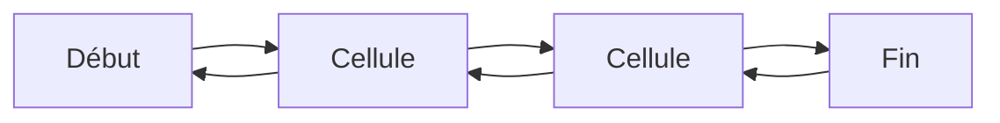
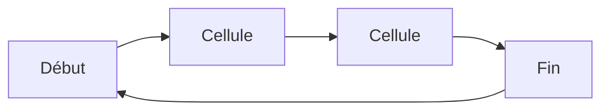

# Exercice 2.1

## Question 1

> **Proposer une implémentation des listes chaînées avec un tableau (le suivant dans la liste n’est pas forcément le suivant dans le tableau). Pensez à gérer la liste des cases libres.**

| 0 | 1 | 2 | 3 | 4 | 5 | 6 | 7 | 8 | 9 |
|---|---|---|---|---|---|---|---|---|---|
|   |   |   |   | 5 | 2 | 8 | 9 |   |   |

1. Suivant dans la liste c'est le suivant dans le tableau
2. Suivant dans la liste n'est pas forcément le suivant dans le tableau


| 0 | 1 | 2 | 3 | 4 | 5 | 6 | 7 | 8 | 9 |
|---|---|---|---|---|---|---|---|---|---|
| 9 |   | 5 |   |   | 8 |   |   |   | 5 |
| -1|   | 9 |   |   | 2 |   |   |   | 8 |

Il faut gérer dans la liste l'ensemble des cases du tableau qui ne contiennent pas un élément de la liste libre : $ \{ 1, 3 , 6, 7 8 \} $

Ex : 
1. `insererDebut(l, 20)`

- On commence par chercher un index libre dans la liste des cases libres


2. Si un élément est supprimé de la liste, son index dans le tableau doit être inséré dans l'ensemble libres

**Fonctions linéaire :**

- `creerListe()`
- `debutListe(l)`
- `estVide(l)`
- `ajouterDebut(l, e)`
- `ajouterFin(l, e)`
- `supprimerDebut(l)`
- `supprimerFin(l)`

3. Faire de même avec les cellules (que l'on demande au système), la liste n'est pas stockée dans un tableau.

On implémente les deux méthodes :

### Méthode 1 : Tableau dans un intervalle

```ruby
function creerListe() {
    n = 42
    Liste l
    tab = new int[n]
    l.tab = tab
    l.taille = 0
    l.debut = 0
    l.fin = 0
    return l
}

function estVide(l) {
    return l.taille == 0
}


function debutListe(l) {
    if (estVide(l)) {
        return -1
    }
    return l.debut
}

function ajouterDebut(l, e) {
    if (l.taille == n) {
        return -1
    }
    l.tab[l.debut] = e
    l.debut = (l.debut + 1) % n
    l.taille = l.taille + 1
    return 0
}

function ajouterFin(l, e) {
    if (l.taille == n) {
        return -1
    }
    l.tab[l.fin] = e
    l.fin = (l.fin - 1) % n
    l.taille = l.taille + 1
    return 0
}

function supprimerDebut(l) {
    if (estVide(l)) {
        return -1
    }
    l.debut = (l.debut - 1) % n
    l.taille = l.taille - 1
    return 0
}

function supprimerFin(l) {
    if (estVide(l)) {
        return -1
    }
    l.fin = (l.fin + 1) % n
    l.taille = l.taille - 1
    return 0
}
```

### Méthode 2 : Tableau où l'on cherche les cases libres

```ruby
function creerListe() {
    n = 42
    Liste l = new Liste()
    tab = new int[n]
    l.tab = tab
    File f = new File()
    for (i = 0; i < n; i++) {
        ajouterFin(f, i)
    }
    l.libres = f
    l.taille = 0
    l.debut = 0
    l.fin = 0
    return l
}

function estVide(l) {
    return l.taille == 0
}

function debutListe(l) {
    if (estVide(l)) {
        return -1
    }
    return l.debut
}

function ajouterDebut(l, e) {
    if (estVide(l.libres)) {
        return -1
    }
    i = supprimerDebut(l.libres)
    l.tab[i] = e
    l.debut = i
    l.taille = l.taille + 1
    return 0
}

function ajouterFin(l, e) {
    if (estVide(l.libres)) {
        return -1
    }
    i = supprimerDebut(l.libres)
    l.tab[i] = e
    l.fin = i
    l.taille = l.taille + 1
    return 0
}

function supprimerDebut(l) {
    if (estVide(l)) {
        return -1
    }
    ajouterFin(l.libres, l.debut)
    l.debut = l.tab[l.debut]
    l.taille = (l.taille - 1) % n
    return 0
}

function supprimerFin(l) {
    if (estVide(l)) {
        return -1
    }
    ajouterFin(l.libres, l.fin)
    l.fin = l.tab[l.fin]
    l.taille = (l.taille - 1) % n
    return 0
}
```


## Question 2

> **Faire de même avec les pointeurs.**

On redéfini la structure d'une cellule, on a un pointeur sur son suivant :

```ruby
enregistrement Cellule {
    T val
    Cellule suiv
}
```

Le système a deux fonctions :

- `allocation()` : alloue une cellule (`malloc` en C, `new` en Java)
- `liberation(c)` : libère une cellule (`free` en C, automatique en Java)

On créera une liste avec un pointeur sur sa première cellule :

```ruby
enregistrement Liste {
    Cellule debutListe
}
```

Pour le code concret, on doit créer une cellule constante qui représentera la fin de la liste (comme le `null` en Java, ou le `None` en Python) :

```ruby
Cellule cVide = ... # Dépend du langage

# En C on peut faire :
# Cellule cVide = NULL

# En Java on peut faire :
# Cellule cVide = null

# En Python on peut faire :
# cVide = None
```

Maintenant, on peut implémenter les fonctions :

```ruby
Liste creerListe() {
    Liste l = new Liste()
    l.debutListe = cVide
    return l
}

bool estVideListe(Liste l) {
    return l.debutListe == cVide
}

Cellule debutListe(Liste l) {
    if (estVideListe(l)) {
        return cVide
    }
    return l.debutListe
}

void ajouterDebut(Liste l, T e) {
    Cellule c = allocation()

    # En C on vérifie si l'allocation a réussi
    # if (c == NULL) {
    #     printf("Erreur d'allocation\n")
    #     exit(1)
    # }

    c.val = e
    c.suiv = l.debutListe
    l.debutListe = c
}

void ajouterFin(Liste l, T e) {
    Cellule c = allocation()
    c.val = e
    c.suiv = cVide

    if (estVideListe(l)) {
        l.debutListe = c
    } else {
        Cellule c2 = l.debutListe
        while (c2.suiv != cVide) {
            c2 = c2.suiv
        }
        c2.suiv = c
    }

}

Liste supprimerDebut(Liste l) {
    if (estVideListe(l)) {
        return l
    }
    Cellule c = l.debutListe
    l.debutListe = c.suiv
    liberation(c)
    return l
}

Liste supprimerFin(Liste l) {
    if (estVideListe(l)) {
        return l
    }
    if (l.debutListe.suiv == cVide) {
        liberation(l.debutListe)
        l.debutListe = cVide
        return l
    }
    Cellule c = l.debutListe
    while (c.suiv.suiv != cVide) {
        c = c.suiv
    }
    liberation(c.suiv)
    c.suiv = cVide
    return l
}

# On pourrait faire une fonction auxiliaire pour aller au dernier élément
# Et l'appeler dans ajouterFin et supprimerFin, car le code est le même
```

## Question 3

> **Comment modifier vos implémentations pour implémenter une liste chaînée bi-directionnelle ? Une liste circulaire ?**

Pour une liste chaînée bi-directionnelle, on peut modifier l'enregistrement `Cellule` pour avoir un pointeur sur la cellule précédente :

```ruby
enregistrement Cellule {
    T val
    Cellule suiv
    Cellule prec
}
```

Un exemple de représentation :



Pour une liste circulaire, peut modifier l'enregistrement `Liste` pour avoir un pointeur sur la dernière cellule :

```ruby
enregistrement Liste {
    Cellule debutListe
    Cellule finListe
}
```

Un exemple de représentation :




# Exercice 2.3

## Question 1

> **Écrire une procédure de concaténation de deux listes en temps $O(1)$**

On rappelle notre implémentation : on a une liste chaînée avec pointeur sur le début et la fin de la liste.

```ruby
enregistrement Liste {
    Cellule debutListe
    Cellule finListe
}
```

On peut donc concaténer deux listes en faisant pointer la fin de la première liste sur le début de la deuxième liste :

```ruby
Liste concatener(Liste l1, Liste l2) {
    if (estVideListe(l1)) {
        return l2
    }
    if (estVideListe(l2)) {
        return l1
    }
    l1.finListe.suiv = l2.debutListe
    l1.finListe = l2.finListe
    return l1
}
```

Le temps est bien en $O(1)$ car on ne fait que modifier les pointeurs.


## Question 2

> **Expliquez comment utiliser les listes pour implémenter le TDA ensemble disjoint. Vous pourrez utiliser la réponse à la question précédente.**

**Rappel du cours :**

- `creerPartition(int n)` crée une partition où chaque partie est un singleton de $[n]$
- `trouver(partie p, int x)` doit donner le représentant de la partie contenant $x$
- `union(partie p, int x, int y)` doit faire l'union de sparties contenant $x$ et $y$

### Ma version

```ruby
enregistrement Liste {
    Element[] tab
    int taille
}

enregistrement Element {
    int val
    Partie p
}

enregistrement Partie {
    int id
    Element debutPartie
    Element finPartie
}
```

```ruby
Partie vide = -1
Element vide = -1

# O(1)
# Car on a juste une allocation
Element creerElement(int x) { # x est un entier
    Element e = allocation()
    e.val = x
    e.p = vide
    return e
}

# O(n)
# Car on doit allouer n éléments
# Chaque allocation est en O(1)
Liste creerPartition(int n) {
    Liste l = allocation()
    l.tab = allocation(n)
    l.taille = n
    for (int i = 0; i < n; i++) {
        l.tab[i] = creerElement(i)
    }
    return l
}

# O(1)
# Car on a un tableau, et on peut accéder à l'élément en O(1)
Partie trouver(Partie p, int x) {
    return p.tab[x].p
}

# O(n)
# Car pour chaque élément de la liste, on doit changer le pointeur
# Changer le pointeur est en O(1)
void union(Partie p, int x, int y) {
    
    Partie px = trouver(p, x)
    Partie py = trouver(p, y)

    Partie plusGrand
    Partie plusPetit

    Si taille(px) > taille(py) {
        plusGrand = px
        plusPetit = py
    } Sinon {
        plusGrand = py
        plusPetit = px
    }

    Element e = plusPetit.debutPartie
    Tant que e != vide, Faire {
        e.p = plusGrand
        e = e.suiv
        plusPetit.finPartie.suiv = e
        plusPetit.finPartie = e
    }

    plusGrand.finPartie.suiv = plusPetit.debutPartie
    plusGrand.finPartie = plusPetit.finPartie

    return p

}
```


### Correction

```ruby
enregistrement Partition {
    Liste<Liste<int>> parties
}

Partition creerPartition(int n) {
    Partition p;
    p.l = creerLise();

    Pour i <- 1 à n, Faire {
        s = creerListe();
        insererDebut(s, i);
        insererDebut(p.l, s);
    }

    Retourner p;
}

int trouver(Partition p, int x) {
    Cellule c = debutliste(p.l)
    Tant que finListe(c) == Faux, Faire {
        Cellule c2 = debutListe(val(c))

        Tant que finListe(c2) == Faux {
            Si x == valeur(c2) {
                Retourner valeur(c)
            }
            c2 = suivant(c2)
        }

        c = suivant(c)
    }

    Retourner -1
}
```

Pour `trouver` : On suppose toujours que valeur suivant et debutListe sont en $O(1)$.

La boucle `Tant Que` est extérieure fait au plus $k$ itérations, $k$ le nombre de parties.

Pour chaque itération $i$, le nombre maximum d'itérations de la boucle est le nombre d'éléments de la partie parcourure à l'itération $i$, nommons cette taille $n_i$.

Complexité en temps :

$$\sum_{i=1}^k n_i$$

Comme les parties sont disjointes, et que l'union des parties c'est l'ensemble à partitionner, $\sum_{i=1}^k = n_i = n$, où $n$ est la taille de l'ensemble à partitionner.

Donc, la complexité est $\sum_{i=1}^k n_i = n$.

```ruby
Partition union(Partition p, int x, int y) {
    l1 = trouver2(p,x) # O(n)
    l2 = trouver2(p,y) # O(n)
    concaténer(l1,l2) # O(n) ou O(1) selon l'implémentation
    supprimer(p.l,l2) # O(nombre de parties) <= O(n)
    retourner p
}

# On définit trouver 2 : 
# Même chose que trouver, sauf que l'on retourne la liste contenant x
# n = la taille de l'ensemble partitionné par p
```
