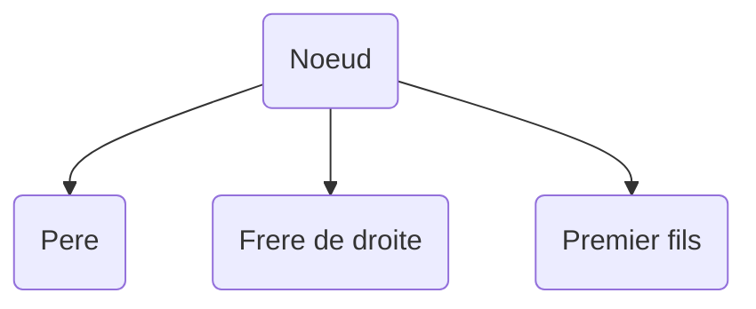
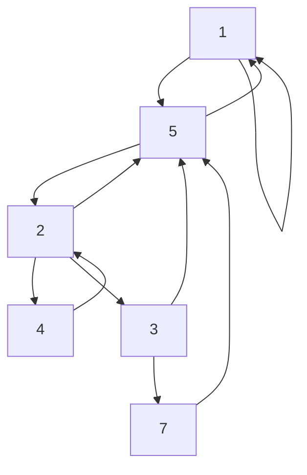
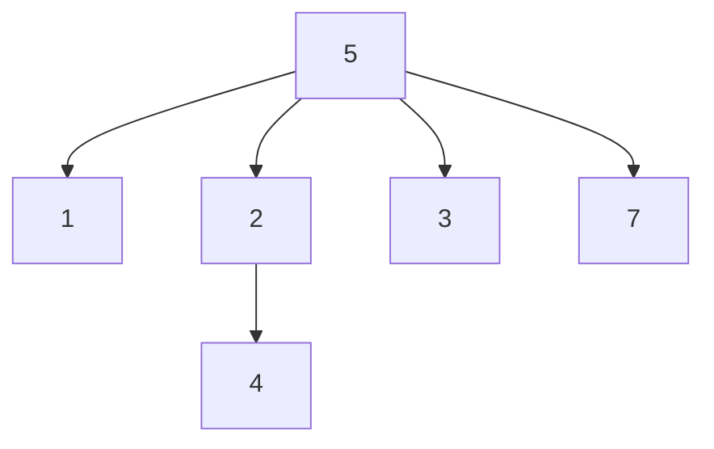

# Exercice 3.1

## Question 1

> **On implémente une arborescence avec le tableau `PERE`, i.e. dans chaque case on stocke l'index du père, et pour la racine on stocke la valeur $-1$. Proposer un algorithme (avec la meilleure complexité) pour chacune des opérations suivantes :**
> - La racine de l'arbre
> - La hauteur $h$ de l'arbre
> - La liste des fils d'un noeud $x$
> - Le sous-arbre issu d'un noeud $x$
> - Tester si $x$ et $y$ sont frères

```ruby
# Racine de l'arbre
# On cherche le premier élément du tableau qui vaut -1
int racine(int[] pere) {
    int i = 0;
    while (pere[i] != -1) {
        i++;
    }
    return i;
}
```

La complexité en temps $O(l)$, où $l$ est le nombre d'itérations de `Tant que`. Comme $l$ peut être égal à $n-1$, la complexité en temps est $O(n)$.


```ruby
# Hauteur de l'arbre
int hauteurNoeud(int Pere[n], int x) {
    int h = 0;
    int y = x;

    while (Pere[y] != -1) {
        h = h + 1;
        y = Pere[y];
    }

    return h + 1;
}
```

Si $h_x$ c'est la distance de la racine au noeud $x$, le nombre d'itérations c'est $h_x$. Donc la complexité en temps est $O(h_x)$.

```ruby
# Hauteur de l'arbre
int hauteur(int Pere[n]) {
    int h = 0;
    int i = 0;

    for (i = 0; i < n; i++) {
        int h_i = hauteurNoeud(Pere, i);
        if (h_i > h) {
            h = h_i;
        }
    }

    return h;
}
```

Complexité : $n$ itérations, chaque itérations $O(h_i)$. Donc au total $\sum_{i=1}^n O(h_i) = O(\sum_{i=1}^n h_i) = O(n \cdot h)$.


```ruby
# Liste des fils d'un noeud x
Liste listeFils(int Pere[n], int x) {
    Liste liste = ListeVide();
    int i = 0;

    for (i = 0; i < n; i++) {
        if (Pere[i] == x) {
            liste = insererDebut(liste, i);
        }
    }

    return liste;
}
```

Si `insererDebut` est $O(1)$, la complexité en temps est $O(n)$.

```ruby
bool frere(int Pere[n], int x, int y) {
    retourner Pere[x] == Pere[y];
}
```

La complexité en temps est $O(1)$ car on n'accède qu'à deux cases du tableau.

```ruby
# Ensemble des feuilles
Liste feuilles(int Pere[n]) {
    bool[n] f;

    # On met à vrai toutes les cases du tableau
    for (i = 0; i < n; i++) {
        f[i] = true;
    }

    for (i=0; i < n; i++) {
        f[Pere[i]] = false;
    }

    Liste l = creerListe();
    for (i = 0; i < n; i++) {
        if (f[i]) {
            l = insererDebut(l, i);
        }
    }

    return l;

}

# Sous-arbre issu d'un noeud x
liste sousArbre(int Pere[n], int x) {
    Liste l = feuilles(Pere);

    for (Feuille feuille in l) {
        if (*En remontant comme dans la fonction hauteurNoeud on rencontre x*) {
            *ajouter tous les noeuds entre f et x dans r*
        }
    }
}
```

On peut vérifier que la complexité en temps est $O(n)$.

## Question 2

> **Comparer avec une implémentation où chaque noeud stocke une référence vers sont père, un premier fils vers sont frère de droite.**





Le graphe ci-dessus représente les relations de l'arbre suivant :



```ruby
enregistrement arbre {
    noeud racine
}

enregistrement noeud {
    noeud pere
    noeud filsG
    noeud frereD
    T val
}

fils(noeud n) {
    l = creerListe();
    noeud d = n.filsG;

    while (d != null) {
        l = insererDebut(l, d);
        d = d.frereD;
    }

    return l;
}