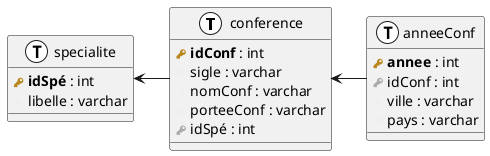
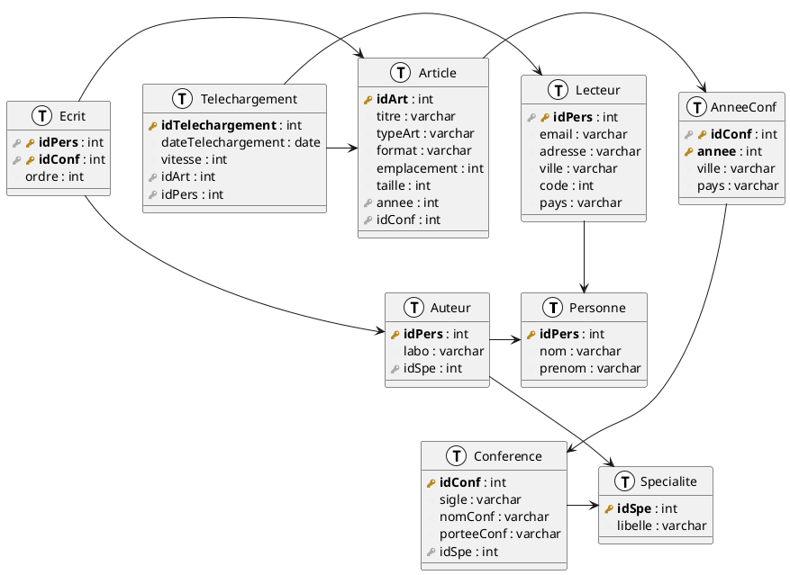

# Cours magistral 1

- Histoire des bases de données (du FBI à IBM)
- Introduction sur les bases de données relationnelles
  - Les contraintes
    - Les contraintes d'intégrité
    - Les contraintes implicites
- TD 1 (wtf)

## TD1

### Exercice 1

On va considérer 3 tables : `Conference`, `Specialite` et `AnneeConf` :



#### Question 1 et 2

> **Donner les super-clés des tables `Spécialité`, et `AnneeConf`.**

Les super-clés de `Specialite` sont :

- `idSpé` (car c'est la clé primaire)
- `idSpé` + `libelle`

Les super-clés de `AnneeConf` sont :

- `annee` et `idConf` (car c'est la clé primaire)
- `idConf`, `annee` et `ville`
- `idConf`, `annee`, `ville` et `pays`


#### Question 3

> **On va considérer que la base de donnée est remplie comme suit :**


> | idSpé | libelle |
> |-------|---------|
> | 0     | DB |


> | idConf | sigle | nomConf | porteeConf | idSpé |
> |--------|-------|---------|------------|-------|
> | 0 | BDA | BD annuelle | France | 0 |

> | idConf | annee | ville | pays |
> |--------|-------|-------|------|
> | 0 | 2022 | Clermont-Ferrand | France |


> **Donner les clés étrangères de ces 3 tables (`Specialite`, `Conference` et `AnneeConf`).**

- `idConf` est une clé étrangère de `AnneeConf`, elle référence `idConf` de `Conference`
- `idSpé` est une clé étrangère de `Conference`, elle référence `idSpé` de `Specialite`
- `Specialite` n'a pas de clé étrangère, car elle n'en référence pas d'autres

En effet on le voit sur le schéma suivant :


##### Question 4.1

> **Que se passe-t-il avec : `INSERT INTO Specialite VALUES (0, 'maths')` ?**

Il y a une erreur car la contrainte de clé primaire est violée par cette insertion.

##### Question 4.2

> **Que se passe-t-il avec : `INSERT INTO AnneConf VALUES (0, 2021, `Paris`, `France`)` ?**

La clé primaire n'est pas violée (la clé est `idConf` + `annee`). Donc l'insertion est possible.

On obtient donc :

> | idConf | annee | ville | pays |
> |--------|-------|-------|------|
> | 0 | 2022 | Clermont-Ferrand | France |
> | 0 | 2021 | Paris | France |

##### Question 4.3

> **Que se passe-t-il avec : `INSERT INTO AnneConf VALUES (1, 2022, `Sydney`, `Australie`)` ?**

L'insertion viole la clé étrangère de la table `AnneeConf` car il n'y a pas de `idConf` = 1 dans la table `Conference`.

##### Question 4.4

> **Que se passe-t-il avec : `INSERT INTO Conference VALUES (1, `VLDB`, `VLDB`, `mondiale`, 0)` ?**

Il n'y a pas de problème car la clé primaire n'est pas violée et la clé étrangère est présente dans la table `Specialite`.

On obtient donc :

> | idConf | sigle | nomConf | porteeConf | idSpé |
> |--------|-------|---------|------------|-------|
> | 0 | BDA | BD annuelle | France | 0 |
> | 1 | VLDB | VLDB | mondiale | 0 |

##### Question 4.5

> **Que se passe-t-il avec : `DELETE FROM Conference WHERE idConf = 0` ?**

La suppression est possible car la clé primaire n'est pas violée. Il existe bien une clé primaire avec `idConf` = 0.

#### Question 5

> **Modifier (très simplement) l’ensemble des opérations précédentes pour qu’elles soient appliquées en ne violant aucune contrainte.**

On peut modifier les opérations précédentes de la manière suivante :

```sql
INSERT INTO Specialite VALUES (1, 'maths');
INSERT INTO AnneConf VALUES (1, 2021, 'Paris', 'France');
INSERT INTO Conference VALUES (1, 'VLDB', 'VLDB', 'mondiale', 1);
DELETE FROM Conference WHERE idConf = 0;
```

On ne viole aucune contrainte avec ces requêtes car on a ajouté une nouvelle spécialité et on a modifié les clés étrangères de `Conference` et `AnneeConf`.

### Exercice 2

#### Question 1

> **Donner le script de création des tables `PERSONNE`, `AUTEUR` et `ECRIT` pour le schéma relationnel donné ci-dessous. N’oubliez pas de spécifier les différentes contraintes d’intégrité.**

Le schéma relationnel est le suivant :




Le script de création des tables est le suivant :

```sql
CREATE TABLE Personne (
    idPers INT NOT NULL,
    nom VARCHAR(50) NOT NULL,
    prenom VARCHAR(50) NOT NULL,
    PRIMARY KEY (idPers)
);

CREATE TABLE Auteur (
    idPers INT NOT NULL,
    labo VARCHAR(50) NOT NULL,
    idSpe INT NOT NULL,
    PRIMARY KEY (idPers),
    FOREIGN KEY (idPers) REFERENCES Personne(idPers),
    FOREIGN KEY (idSpe) REFERENCES Specialite(idSpe)
);

CREATE TABLE Ecrit (
    idPers INT NOT NULL,
    idConf INT NOT NULL,
    ordre INT NOT NULL,
    PRIMARY KEY (idPers, idConf),
    FOREIGN KEY (idPers) REFERENCES Personne(idPers),
    FOREIGN KEY (idConf) REFERENCES Conference(idConf)
);
```

#### Question 2

> **Vider la table avec des auteurs.**

On peut vider la table avec des auteurs avec la requête suivante :

```sql
DELETE FROM Auteur;
```

#### Question 3

> **Supprimer les tables PERSONNE, AUTEUR et ECRIT.**

On peut supprimer les tables avec la requête suivante :

```sql
DROP TABLE Ecrit;
DROP TABLE Auteur;
DROP TABLE Personne;
```

### Exercice 3

#### Question 1

> **Écrire une requête SQL pour récupérer les spécialités.**

On peut récupérer les spécialités avec la requête suivante :

```sql
SELECT * FROM Specialite;
```

#### Question 2

> **Écrire une requête SQL pour récupérer les sigles et noms des conférences.**

On peut récupérer les sigles et noms des conférences avec la requête suivante :

```sql
SELECT sigle, nomConf FROM Conference;
```

#### Question 3

> **Écrire une requête SQL pour récupérer sans répétition les villes où une conférence a eu lieu.**

On peut récupérer les villes où une conférence a eu lieu avec la requête suivante :

```sql
SELECT DISTINCT ville FROM AnneeConf;
```

#### Question 4

> **Écrire une requête SQL pour récupérer les noms de conférence associée aux villes et l’année où elle a eu lieu.**

On peut récupérer les noms de conférence associée aux villes et l'année où elle a eu lieu avec la requête suivante :

```sql
SELECT nomConf, ville, annee FROM AnneeConf NATURAL JOIN Conference;
```
