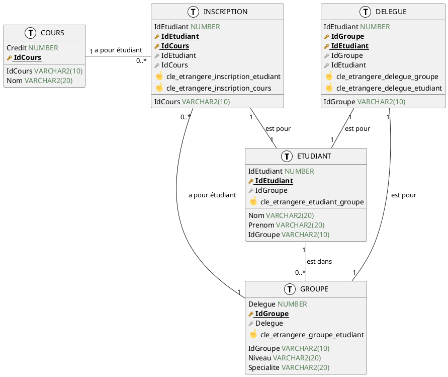

# Exercice 1

## Question 1

> **Créer la table `GROUPE` avec les attributs suivants :**

```sql
CREATE TABLE GROUPE (
IdGroupe VARCHAR(10),
Niveau VARCHAR2(20),
Specialite VARCHAR2(20) ,
CONSTRAINT cle_primaire_groupe PRIMARY KEY (IdGroupe)) 
```

> **Insérer le groupe d'identifiant `L2INFO` et de niveau `licence 2` et de spécialité `informatique`. Pouvez-vous insérer un groupe avec le même identifiant ? Pourquoi ?**

```sql
INSERT INTO GROUPE VALUES ('L2INFO', 'licence 2', 'informatique');
INSERT INTO GROUPE VALUES ('L2INFO', 'licence 2', 'informatique');
```

On ne peut pas rajouter une deuxième fois le même identifiant car il est en clé primaire : `ORA-00001: unique constraint (C##ADMIN.CLE_PRIMAIRE_GROUPE) violated`.

## Question 2

> **Créer la table `ETUDIANT` avec les attributs suivants :**

```sql
CREATE TABLE ETUDIANT (
IdEtudiant NUMBER,
Prenom VARCHAR2(20),
Nom VARCHAR2(20),
Groupe VARCHAR2(10) NOT NULL,
CONSTRAINT cle_primaire_etudiant PRIMARY KEY (IdEtudiant),
CONSTRAINT cle_etrangere_etudiant_groupe FOREIGN KEY (Groupe) REFERENCES GROUPE (IdGroupe));
```

> **Ajouter l’étudiante `Ada Lovelace` au groupe des licences 2 info.**

```sql
INSERT INTO ETUDIANT VALUES (1, 'Ada', 'Lovelace', 'L2INFO');
```

## Question 3

> **On souhaite ajouter `Margaret Hamilton` au groupe des licences 1 math/info. Faites les modifications nécessaires pour faire cette ajout.**

On doit d'abord créer le groupe `L1MATH/INFO` :

```sql
INSERT INTO GROUPE VALUES ('L1MATHINFO', 'licence 1', 'math/info');
```

Puis on peut ajouter l'étudiante :

```sql
INSERT INTO ETUDIANT VALUES (2, 'Margaret', 'Hamilton', 'L1MATHINFO');
```

## Question 4

> **Créer les tables `INSCRIPTION` et `COURS` en suivant les exemples précédents. Ajouter les informations suivantes dans ces deux tables**

- **un cours d’anglais d’identifiant `ANG` avec 2 crédits**
- **un cours de base de données d’identifiant `BD` avec 5 crédits**
- **un cours de programmation d’identifiant `PROG` avec 6 crédits**


On crée la table `COURS` :

```sql
CREATE TABLE COURS (
    IdCours VARCHAR2(10),
    Credit NUMBER,
    CONSTRAINT cle_primaire_cours PRIMARY KEY (IdCours));
```

Puis on crée la table `INSCRIPTION` :

```sql
CREATE TABLE INSCRIPTION (
    IdEtudiant NUMBER,
    IdCours VARCHAR2(10),
    CONSTRAINT cle_primaire_inscription PRIMARY KEY (IdEtudiant, IdCours),
    CONSTRAINT cle_etrangere_inscription_etudiant FOREIGN KEY (IdEtudiant) REFERENCES ETUDIANT (IdEtudiant),
    CONSTRAINT cle_etrangere_inscription_cours FOREIGN KEY (IdCours) REFERENCES COURS (IdCours));
```


## Question 5

> **Tester les contraintes de ces deux tables avec opérations suivantes. Imaginer à l’avance la réponse et l’état de la base de données avant d’exécuter les opérations. Décrire en français les opérations qui ont un sens.**

```sql
-- J'ai rajouté 1 à chaque nombre après car mon premier étudiant a l'ID 1 et non 0


INSERT INTO INSCRIPTION VALUES (1, 'ANG');
-- Une deuxième fois
INSERT INTO INSCRIPTION VALUES (1, 'ANG');
INSERT INTO INSCRIPTION VALUES (2, 'ANG');
INSERT INTO INSCRIPTION VALUES (3, 'BD');
-- Avec une faute de frappe
INSERT INTO INSCRIPTION VALUES (3, 'PORG');
```

On obtient les résultats suivants :

- `1 row created.`
- `ORA-00001: unique constraint (C##ADMIN.CLE_PRIMAIRE_INSCRIPTION) violated` : on ne peut pas insérer deux fois le même identifiant
- `1 row created.`
- `RA-02291: integrity constraint (C##ADMIN.CLE_ETRANGERE_INSCRIPTION_ETUDIANT) violated - parent key not found` : on ne peut pas insérer un étudiant qui n'existe pas
- `ORA-02291: integrity constraint (C##ADMIN.CLE_ETRANGERE_INSCRIPTION_COURS) violated - parent key not found` : on ne peut pas insérer un cours qui n'existe pas


## Question 6

> **Vider la table `INSCRIPTION`.**

```sql
DELETE FROM INSCRIPTION;
```

# Exercice 2

> **On souhaite que la base de données respecte la contrainte suivante :**

> **Tous les étudiants sont soit inscrits à des cours pour un total d’au moins 7 crédits soit inscrits à aucun cours**
> **Nous allons utiliser deux sessions d’Oracle en parallèle avec les rôles suivants :**
> — **Session 1 opère les modifications, c’est celle de l’administrateur**
> — **Session 2 observe très régulièrement l’état de la base. Aucun état incohérent ne doit jamais être visible depuis cette session**


On active les deux sessions :

```sql
ALTER SESSION ENABLE PARALLEL DML;
```

## Question 7

> **Dans la session 2, rédiger une requête pour obtenir le total nombre de crédit des cours auquel chaque étudiante est inscrite.**

```sql
SELECT IdEtudiant, SUM(Credit) AS TotalCredit
FROM INSCRIPTION
JOIN COURS ON INSCRIPTION.IdCours = COURS.IdCours
GROUP BY IdEtudiant;
```


## Question 8

> **Ada Lovelace souhaite s’inscrire au cours d’anglais et de base de données. Procéder à son inscription depuis la session 1 à l’aide d’une transaction. À chaque opération, vérifiez le total des crédits par étudiant depuis la session 2. Si vous constatez un état incohérent, videz la table `INSCRIPTION` et recommencez**

```sql
-- On utilise la transaction pour que les deux INSERT soient effectués en même temps
BEGIN TRANSACTION;
INSERT INTO INSCRIPTION VALUES (1, 'ANG');
INSERT INTO INSCRIPTION VALUES (1, 'BD');
COMMIT;
```

Dans la session 2, on obtient :

| IdEtudiant | TotalCredit |
|------------|-------------|
| 1          | 7           |

## Question 9

> **Margaret Hamilton souhaite être inscrite au cours d’anglais et de programmation. Commencer une première transaction et annulez la après avoir exécuté votre première requête. Vérifiez le total des crédits par étudiant depuis les deux sessions.**

```sql
BEGIN TRANSACTION;
INSERT INTO INSCRIPTION VALUES (2, 'ANG');
-- On annule la transaction
ROLLBACK;
```

Dans la session 2, on obtient :

| IdEtudiant | TotalCredit |
|------------|-------------|
| 1          | 7           |

On a bien annulé la transaction.


# Exercice 3

> **On souhaite que chaque groupe ait un délégué. Pour ce faire, on commence par ajouter une colonne à la table GROUPE avec l’opération suivante**

```sql
ALTER TABLE GROUPE ADD Delegue NUMBER;
```

## Question 10

> **Regarder les groupes où les délégués ne sont pas définis, c’est à dire `NULL`. Ajouter manuellement une délégué pour chacun de ces groupes. Une fois que vous avez terminé, modifier la colonne pour interdire la valeur `NULL` :**

```sql
LTER TABLE GROUPE MODIFY Delegue NUMBER NOT NULL;
```

## Question 11

> **On souhaite maintenant ajouter une contrainte sur la table `GROUPE` pour assurer que tous les groupes ont un étudiant comme délégué. Pour ajouter cette contrainte, utiliser une commande de la forme suivante où `CONSTRAINT` nom ... est de la même forme que l’introduction d’une contrainte dans la création d’une table**

```sql
ALTER TABLE GROUPE ADD CONSTRAINT nom ...;
```

On crée la contrainte :

```sql
ALTER TABLE GROUPE ADD CONSTRAINT cle_etrangere_groupe_etudiant FOREIGN KEY (Delegue) REFERENCES ETUDIANT (IdEtudiant);
```

> **On souhaite ajouter un étudiant Kurt Gödel comme le délégué et appartenant au nouveau groupe des licences 2 mathématiques. Proposer une transaction pour ajouter l’étudiant et le groupe. Que se passe-t-il ?**

```sql
-- On supprime les contraintes, et on les recréer avec DEFERRABLE INITIALLY DEFERRED
ALTER TABLE GROUPE DROP CONSTRAINT cle_etrangere_groupe_etudiant;
ALTER TABLE GROUPE ADD CONSTRAINT cle_etrangere_groupe_etudiant FOREIGN KEY (Delegue) REFERENCES ETUDIANT (IdEtudiant) DEFERRABLE INITIALLY DEFERRED;


-- On indique que l'on souhaite utiliser les contraintes
SET CONSTRAINTS ALL DEFERRED;

-- On ajoute l'étudiant
INSERT INTO ETUDIANT VALUES (4, 'Kurt', 'Gödel', 'L2MATH');

-- On ajoute le groupe
INSERT INTO GROUPE VALUES ('L2MATH', 'licence 2', 'math', 4);

COMMIT;
```

On obtient :

| IdGroupe  | Niveau  | Specialite | Delegue |
|-----------|---------|------------|---------|
| L2INFO    |licence 2|informatique| 1       |
| L2MATHINFO|licence 1|math/info   | 2       |
| L2MATH    |licence 2|math        | 4       |

## Question 12

> **L’administration de cette base de données se rend compte qu’il n’y a pas de contrainte pour s’assurer que le délégué d’un groupe soit un étudiant du même groupe. Proposer une modification de la base de données (notamment le schéma) pour que les contraintes d’intégrité valident cette propriété.**

On crée une nouvelle table `DELEGUE` :

```sql
CREATE TABLE DELEGUE (
    IdGroupe VARCHAR2(10) NOT NULL,
    IdEtudiant NUMBER NOT NULL,
    PRIMARY KEY (IdGroupe, IdEtudiant),
    FOREIGN KEY (IdGroupe) REFERENCES GROUPE (IdGroupe),
    FOREIGN KEY (IdEtudiant) REFERENCES ETUDIANT (IdEtudiant)
);
```

Le schéma de la base de données est maintenant :




