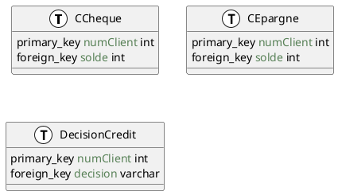

# Exercice 1

> **Créer les tables du schéma en choisissant le type de chaque colonne à l’aide des informations suivantes :**
> — CCheque et CEpargne contiennent le numéro du client propriétaire du compte et son solde qui peut être négatif.
> — DecisionCredit contient le dossier des demandes de crédit de chaque client avec la décision
> associée (OK si elle est acceptée, KO sinon).




```sql
CREATE TABLE CCheque (
    numClient INT PRIMARY KEY,
    solde INT
);

CREATE TABLE CEpargne (
    numClient INT PRIMARY KEY,
    solde INT
);

CREATE TABLE DecisionCredit (
    numClient INT PRIMARY KEY,
    decision VARCHAR(2)
);
```

> **Insérer les données suivantes dans les tables :**

```sql
INSERT INTO CCheque VALUES (1, 1000);
INSERT INTO CCheque VALUES (2, 2000);
INSERT INTO CCheque VALUES (3, 3000);
INSERT INTO CCheque VALUES (4, 4000);
INSERT INTO CEpargne VALUES (1, 1000);
INSERT INTO CEpargne VALUES (2, 2000);
INSERT INTO CEpargne VALUES (3, 3000);
INSERT INTO CEpargne VALUES (4, 4000);
```


# Exercice 2

Au cours de cet exercice, assurez-vous que suffisamment de données soient insérer dans la base pour répondre aux questions. On supposera que chaque client a déjà un compte chèque et un compte
épargne.

## Question 1

> **On souhaite implémenter la procédure epargner(c, m) qui permet de transférer le montant m du compte chèque d’un client vers son compte épargne, uniquement dans le cas où le solde du compte chèque reste positif. Pour se faire, nous allons utiliser le langage PL/SQL, en complétant la procèdure ci-dessous :**

```sql
CREATE OR REPLACE PROCEDURE epargner ( c NUMBER, m NUMBER) AS
v_solde NUMBER;
BEGIN
SELECT solde INTO v_solde FROM CCheque WHERE client=c ;
DBMS_OUTPUT. PUT_LINE ( 'SoldeCheque : ' | | v_solde ) ;
END;
/
```

> **Pour voir les sortie de la procédure, il faut activer leur affichage avec :**

```sql
SET SERVEROUTPUT ON
```

On modifie la procédure pour qu’elle effectue le transfert de fonds si le solde du compte chèque est positif.

```sql
CREATE OR REPLACE PROCEDURE epargner (c NUMBER, m NUMBER) AS
v_solde NUMBER;
BEGIN
SELECT solde INTO v_solde FROM CCheque WHERE numClient=c ;
DBMS_OUTPUT. PUT_LINE ( 'SoldeCheque : ' || v_solde ) ;
IF v_solde > 0 THEN
    UPDATE CCheque SET solde = solde - m WHERE numClient = c;
    UPDATE CEpargne SET solde = solde + m WHERE numClient = c;
END IF;
END;
/
```

## Question 2

> **Modifier votre procèdure pour epargner (c NUMBER, m NUMBER, delai NUMBER) en insérant la commande DBMS_SESSION.sleep(delai); pour simuler un délai entre certaines des opérations effectuée. Utilisez ce délai pour obtenir une exécution en parallèle de deux de ces transferts vers le compte épargne d’un même client telles que le solde chèque du client devienne négatif à cause d’une lecture non reproductible.**

```sql
CREATE OR REPLACE PROCEDURE epargner (c NUMBER, m NUMBER, delai NUMBER) AS
v_solde NUMBER;
BEGIN
SELECT solde INTO v_solde FROM CCheque WHERE numClient=c ;
DBMS_OUTPUT. PUT_LINE ( 'SoldeCheque : ' || v_solde ) ;
IF v_solde > 0 THEN
    DBMS_SESSION.sleep(delai);
    UPDATE CCheque SET solde = solde - m WHERE numClient = c;
    DBMS_SESSION.sleep(delai);
    UPDATE CEpargne SET solde = solde + m WHERE numClient = c;
END IF;
END;
/
```


## Question 3. 

> **Implémentez une nouvelle procédure traitementCredit(c, m), qui inscrit une nouvelle décision de crédit. Si le montant de crédit demandé m est 3 fois supérieur à la somme des soldes de ces comptes chèques et épargne, le crédit est accepté, sinon, la demande de crédit est rejetée.**

```sql
CREATE OR REPLACE PROCEDURE traitementCredit (c NUMBER, m NUMBER) AS
v_soldeCheque NUMBER;
v_soldeEpargne NUMBER;
BEGIN
SELECT solde INTO v_soldeCheque FROM CCheque WHERE numClient=c ;
SELECT solde INTO v_soldeEpargne FROM CEpargne WHERE numClient=c ;
IF m > 3 * (v_soldeCheque + v_soldeEpargne) THEN
    INSERT INTO DecisionCredit VALUES (c, 'OK');
ELSE
    INSERT INTO DecisionCredit VALUES (c, 'KO');
END IF;
END;
/
```

## Question 4

> **Ajoutez aussi un délai à la procédure traitementCredit. Exécuter en parallèle un traitement de crédit avec un transfert, si bien que le crédit soit accepté ou refusé alors qu’il n’aurait pas dû l’être.**

```sql
CREATE OR REPLACE PROCEDURE traitementCredit (c NUMBER, m NUMBER, delai NUMBER) AS
v_soldeCheque NUMBER;
v_soldeEpargne NUMBER;
BEGIN
SELECT solde INTO v_soldeCheque FROM CCheque WHERE numClient=c ;
SELECT solde INTO v_soldeEpargne FROM CEpargne WHERE numClient=c ;
IF m > 3 * (v_soldeCheque + v_soldeEpargne) THEN
    DBMS_SESSION.sleep(delai);
    INSERT INTO DecisionCredit VALUES (c, 'OK');
ELSE
    DBMS_SESSION.sleep(delai);
    INSERT INTO DecisionCredit VALUES (c, 'KO');
END IF;
END;
/
```

# Exercice 3

Oracle permet d’appliquer un verrou sur une table dans une transaction pour limiter les opérations des autres transactions sur cette table. Il y a deux modes de verrous :

— SHARE permet les lectures depuis les autres transactions, mais bloque les écritures,
— EXCLUSIVE bloque les écritures et les lectures des autres transactions.

On pose un verrou en utilisant une commande de la forme suivante :

```sql
LOCK TABLE DecisionCredit IN SHARE MODE;
```

À la fin de la transaction, le verrou est automatiquement libéré.

## Question 5

> **Tester les compatibilités entre les différents modes de verrous. Est-ce qu’une transaction peut prendre un verrou SHARE ou EXCLUSIVE lorsqu’une autre transaction détient un verrou SHARE ou EXCLUSIVE sur la même table ?**

On LOCK la table DecisionCredit en SHARE MODE dans une transaction, puis on tente de LOCK la table en EXCLUSIVE MODE dans une autre transaction. 

```sql
LOCK TABLE DecisionCredit IN SHARE MODE;
```

```sql
LOCK TABLE DecisionCredit IN EXCLUSIVE MODE;
```

On a la seconde transaction qui bloque, car la première transaction a déjà un verrou sur la table. 

On peut désactiver le verrou de la table en utilisant la commande suivante :

```sql
ALTER TABLE DecisionCredit NOLOCK;
```

