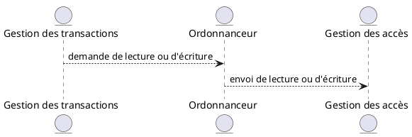

<!-- # Rappels lectures impropres et non reproductibles

Une lecture impropre est une lecture dont la valeur est erronée car elle a été modifiée entre le moment où elle a été lue et le moment où elle a été utilisée.

Une lecture non reproductible est une lecture où la valeur lue est erronée car elle a été modifiée entre le moment où elle a été lue et le moment où elle a été utilisée. C'est une lecture impropre qui a été modifiée par un autre processus.

La différence entre les deux est que la lecture impropre est modifiée par le même processus qui l'a lue, alors que la lecture non reproductible est modifiée par un autre processus.

Et `SERIALIZABLE` permet de garantir que les lectures sont reproductibles
 -->

# Les concurrences

## Gestion de la concurrence

Quand on exécute une requête, on récupère les données de la mémoire permanente, et sont stockées dans la mémoire vive.

Le gestionnaire de transactions est chargé de gérer les accès concurrents aux données.

Nous allons étudier :

- La sériabilisation d'une transaction
- La sériabilisation par accès concurrent
- Un système de verrous pour assurer la sériabilisation

### Executions sérialisables

#### Executions concurrentes

##### Définition

Une execution concurrente est une suite d'opération prises par une ou plusieurs transactions qui sont exécutées en même temps. on considère deux types d'opérations :

- `read(x, t)` : la transaction `t` lit la valeur de la variable `x`
- `write(x, t)` : la transaction `t` écrit la valeur de la variable `x`

##### Exemple

| $T_1$         | $T_2$         |
|---------------|---------------|
| $read(A, t)$  | $read(A, s)$  |
| $t = t + 100$ | $s = 2 * s$   |
| $write(A, t)$ | $write(A, s)$ |
| $read(B, t)$  | $read(B, s)$  |
| $t = t + 100$ | $s = 2 * s$   |
| $write(B, t)$ | $write(B, s)$ |

##### Définition

On dit qu'une execution est en série si toutes les opérations de chaque  transaction sont exécutées de manière consécutive.

##### Exemple

| $T_1$         | $T_2$         | $A$   | $B$   |
|---------------|---------------|-------|-------|
| $read(A, t)$  | -             | $25$  | $25$  |
| $t = t + 100$ | -             | ...   | ...   |
| $write(A, t)$ | -             | $125$ | ...   |
| $read(B, t)$  | -             | ...   | ...   |
| $t = t + 100$ | -             | ...   | ...   |
| $write(B, t)$ | -             | ...   | $125$ |
| -             | $read(A, s)$  | ...   | ...   |
| -             | $s = 2 * s$   | ...   | ...   |
| -             | $write(A, s)$ | $250$ | ...   |
| -             | $read(B, s)$  | ...   | ...   |
| -             | $s = 2 * s$   | ...   | ...   |
| -             | $write(B, s)$ | ...   | $250$ |

On vient de faire l'exécution en scène de $T_1$ et $T_2$, on la note $(T_1, T_2)$.

##### Exercice

Exécutez $(T_2, T_1)$ (la réciproque de $(T_1, T_2)$).

| $T_2$         | $T_1$         | $A$   | $B$   |
|---------------|---------------|-------|-------|
| $read(A, s)$  | -             | $25$  | $25$  |
| $s = 2 * s$   | -             | ...   | ...   |
| $write(A, s)$ | -             | $50$  | ...   |
| $read(B, s)$  | -             | ...   | ...   |
| $s = 2 * s$   | -             | ...   | ...   |
| $write(B, s)$ | -             | ...   | $50$  |
| -             | $read(A, t)$  | ...   | ...   |
| -             | $t = t + 100$ | ...   | ...   |
| -             | $write(A, t)$ | $150$ | ...   |
| -             | $read(B, t)$  | ...   | ...   |
| -             | $t = t + 100$ | ...   | ...   |
| -             | $write(B, t)$ | ...   | $150$ |

On observe que l'état de la base de données est différent entre les deux exécutions.

#### Executions sérialisables

Quelles sont les exécutions qui garantissent la préservation de la cohérence des données ?

##### Définition

Une execution $E$ est sérialisable s'il existe une exécution en série $E'$ qui est équivalente à $E$ i.e. qu'elles ont le même effet sur toutes les BDD.

##### Exemple

Une exemple de transaction sérialisable est :

| $T_1$         | $T_2$         | $A$   | $B$   |
|---------------|---------------|-------|-------|
| $read(A, t)$  | -             | $25$  | $25$  |
| $t = t + 100$ | -             | ...   | ...   |
| $write(A, t)$ | -             | $125$ | ...   |
| ...           | $read(A, s)$  | ...   | ...   |
| ...           | $s = 2 * s$   | ...   | ...   |
| ...           | $write(A, s)$ | $250$ | ...   |
| $read(B, t)$  | -             | ...   | ...   |
| $t = t + 100$ | -             | ...   | ...   |
| $write(B, t)$ | -             | ...   | $125$ |
| ...           | $read(B, s)$  | ...   | ...   |
| ...           | $s = 2 * s$   | ...   | ...   |
| ...           | $write(B, s)$ | ...   | $250$ |

Cette exécution n'est pas en série mais elle est équivalente à l'exécution en série $(T_1, T_2)$. En effet, $A$ est transformé en $2\times (A + 100)$ et pareil pour $B$.

##### Exemple

Un exemple de transaction non sérialisable est :

| $T_1$         | $T_2$         | $A$   | $B$   |
|---------------|---------------|-------|-------|
| $read(A, t)$  | -             | $25$  | $25$  |
| $t = t + 100$ | -             | ...   | ...   |
| $write(A, t)$ | -             | $125$ | ...   |
| ...           | $read(A, s)$  | ...   | ...   |
| ...           | $s = 2 * s$   | ...   | ...   |
| ...           | $write(A, s)$ | $250$ | ...   |
| ...           | $read(B, s)$  | ...   | ...   |
| ...           | $s = 2 * s$   | ...   | ...   |
| ...           | $write(B, s)$ | ...   | $50$  |
| $read(B, t)$  | -             | ...   | ...   |
| $t = t + 100$ | -             | ...   | ...   |
| $write(B, t)$ | -             | ...   | $150$ |

##### Exemple

Il est compliqué de savoir si une exécution est sérialisable ou non. Par exemple, l'exécution suivante est-elle sérialisable ?

| $T_1$         | $T_2$         | $A$   | $B$   |
|---------------|---------------|-------|-------|
| $read(A, t)$  | -             | $25$  | $25$  |
| $t = t + 100$ | -             | ...   | ...   |
| $write(A, t)$ | -             | $125$ | ...   |
| ...           | $read(A, s)$  | ...   | ...   |
| ...           | $s = s + 200$ | ...   | ...   |
| ...           | $write(A, s)$ | $325$ | ...   |
| ...           | $read(B, s)$  | ...   | ...   |
| ...           | $s = s + 200$ | ...   | ...   |
| ...           | $write(B, s)$ | ...   | $225$ |
| $read(B, t)$  | -             | ...   | ...   |
| $t = t + 100$ | -             | ...   | ...   |
| $write(B, t)$ | -             | ...   | $325$ |

Ici on est sérialisable et cela vient du fait que l'on effecture uniquement des additions dont l'ordre ne compte pas.

Par la suite, on concidère toujours le cas où l'ordre compte et on fera abstraction de la modification des valeurs.

### Sériabilité par conflits

On utilise les notations suivantes :

- `r_i(x)` : la transaction $T_i$ lit la valeur $x$ de la BDD
- `w_i(x)` : la transaction $T_i$ écrit la valeur $x$ de la BDD

La transacation sérialisable précédante peut s'écrire :

<!-- $$ r_1(A) \rightarrow w_1(A) \rightarrow r_2(A) \rightarrow w_2(A) \rightarrow r_1(B) \rightarrow w_1(B) \rightarrow r_2(B) \rightarrow w_2(B) $$ -->

$$ E = \{r_1(A), w_1(A), r_2(A), w_2(A), r_1(B), w_1(B), r_2(B), w_2(B)\} $$

#### Conflit

##### Définition

On oarke de conflit entre deux opérations consécutives d'une exécution lorsque leur ordre ne peut pas être inversé sans changer le résultat de l'exécution.

On sait qu'il n'y a pas de fconflit entre les pairs d'opérations suivantes issu des transaction $T_i$ et $T_j$ :

1. $r_i(A)$ et $r_j(A)$
2. $r_i(A)$ et $w_j(A)$ avec $i \neq j$
3. $w_i(A)$ et $r_j(A)$ avec $i \neq j$

Par contre, il y a un confit entre les paires d'opérations suivantes issu des transaction $T_i$ et $T_j$ :

1. Deux opérations qui sont dans la même transaction $T_i$
2. $w_i(A)$ et $w_j(A)$ avec $i \neq j$
3. $r_i(A)$ et $w_j(A)$ ou $w_i(A)$ et $r_j(A)$

Pour résumer, on peut exécuter deux opérations consécutives issues de deux transactions différentes si : 

- Elles s sont sur des éléments différents
- Elles sont deux lectures

##### Exemple

$E = \{r_1(A), w_1(A), r_2(B), w_2(B)\}$ est une exécution de $T_1$ et $T_2$.

On a une exécution équivalente :

- $E = \{r_1(A), r_2(B), w_1(A), w_2(B)\}$

##### Définition

On dit que deux exécution sont équivalente par conflit si on peut passer de l'une à l'autre en inversant des opérations consécutives sans conflit.

#### Propriété

Si une exécution est sérialisable par conflit alors elle est sérialisable.