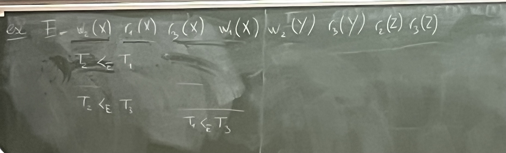

# Rappel du cours précédent

On a montré par inversions successives que $E_0$ est équivalente par conflit à $(T_1,T_2)$. Cela constitue une preuve de la sériabilité par conflit de $E_0$, donc $E_0$ est sériable.

# Graphe de précédence

On utilise le graphe de précédence pour décider si une exécution est sérialisable par conflit. 

Pour une exécution donnée, on organise ses transactions vis à vis d'un ordre de précédence.

## Définition

On dit que $T_i$ précède $T_j$ dans une exécution $E_1$ noté $T_i \prec_{E_1} T_j$ s'il y a deux opérations $O_i$ dans $T_i$ et $O_j$ dans $T_j$ dans $T_j$ telles que :

1. $O_i$ précède $O_j$ dans $E_1$.
2. $O_i$ et $O_j$ s'applique sur le même élément de la base de données.
3. $O_i$ et $O_j$ sont des opérations d'écriture.

### Exemple

$$\begin{aligned}
E &= W_2(X) \ R_1(X) \ R_3(X) \ W_1(X) \ W_2(X) \ R_3(Y) \ R_2(Z) \ R_3(Z)\\
\end{aligned}$$

**Remarque** : $T_i \prec_E T_j$ à cause de $O_i$ et $O_j$, alors on sait que l'ordre $O_i$ et $O_j$ ne pourra pas être inversé dans les exécution équivalentes par conflit à $E$.

De plus, si $E$ est sérialisable par conflit, dans toute exécution en série équivalente par conflit à $E$, $T_i$ apparaîtra nécessairement avant $T_j$.

## Définition

Le graphe de précédence d'une exécution $E$ est un graphe orienté où :

- les noeuds du graphe sont les transactions de $E$
- il y a une arrête de $T_i$ vers $T_j$ si $T_i \prec_{E} T_j$

### Exemple

Le graphe de précédence du dernier exemple :

## Proposition

Une exécution est sérialisable par conflit si et seulement si son graphe de précédence ne contient pas de cycle (acyclique).

### Exemple

$$\begin{aligned}
E' &= R_2(A) \ R_1(B) \ W_2(A) \ R_2(B) \ R_3(A) \ W_1(B) \ W_3(A) \ W_2(B)
\end{aligned}$$

On obtient comme données :

- $T_2\prec_{E'}T_3$
- $T_1\prec_{E'}T_2$
- $T_2\prec_{E'}T_1$

On obtient le graphe suivant :

## Proposition

Si $E$ est sérialisable par conflit, alors $E$ est équivalente par conflit à toute exécution en série des transactions de $E$ où $T_i$ apparaît avant $T_j$ dès qu'il existe une arrête de $T_i$ vers $T_j$ dans le graphe de précédence de $E$.

### Exemple

Le graphe de précédence de l'exemple avec $E$ :

On sait que $E$ est équivalente par conflit à $(T_2,T_3,T_1)$.

# Assurer la sériabilité à l'aide de verrous

En pratique : les opérations de chaque transaction arrivent dans un certain ordre au cours du temps. On ne chercher plus à savoir si l'exécution dans cet ordre est sérialisable, mais on cherche à différer certaines de ces opérations (un minimum) pour conserver la sérialisibilité.

Pour ce faire, les transactions vont poser des verrous sur les éléments de la base de données.

## Verrous

On considère deux types de verrous :

- **Verrou partagé** (shared lock) : nécessaire pour lire un élément
- **Verrou exclusif** (exclusive lock) : nécessaire pour écrire un élément

et des opérations correspondantes :

- $s_i(x)$ : la transaction $T_i$ obtient un verrou partagé sur l'élément $x$
- $x_i(x)$ : la transaction $T_i$ obtient un verrou exclusif sur l'élément $x$
- $u_i(x)$ : la transaction $T_i$ relâche ses verrous sur les éléments $x$

Dans une exécution, on dit que $T_i$ à un verrou partagé ou exclusif entre $s_i(x)$ (ou $x_i(x)$) et la première opération $u_i(x)$ qui suit.

### Exemple

$$\begin{aligned}
s_1(A) \ r_1(A) \ u_1(A) \ s_1(B) \ r_1(B) \ x_1(A) \ w_1(A) \ u_1(A) \ u_1(B)
\end{aligned}$$

Pour assurer le bon usage des verrous, on impose que :

- Sur chaque transaction $T_1$
  - Une lecture $r_i(x)$ ne peut être exécutée que si $T_i$ a un verrou partagé ou exclusif sur $x$.
  - Une écriture $w_i(x)$ ne peut être exécutée que si $T_i$ a un verrou exclusif sur $x$.
  - Tous les verrous qui sont obtenus sont libérés avant la fin de la transaction.
- sur les exécutions, à chaque instant, un élément de la base peut-être 
  - Soit vérouillée de manière exclusive par une unique transaction $T_i$.
  - Soit vérouillée de manière partagée par plusieurs transactions $T_i$.
  - Mais pas les deux à la fois.