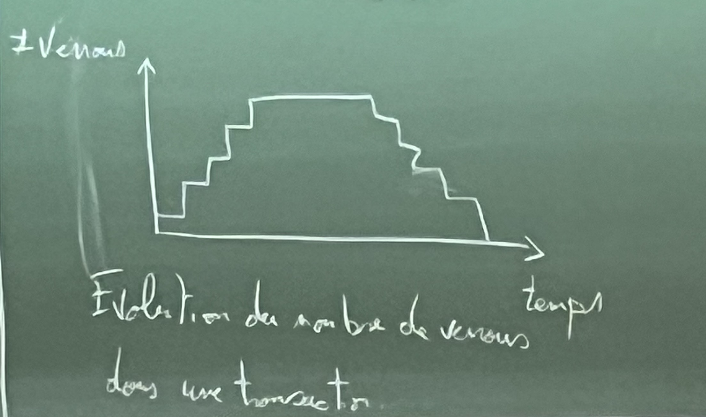

| | partagé | exclusif |
|- | --- | --- |
| partagé | accepté | refusé |
| exclusif | refusé | refusé |

Si un élément est vérouillé de manière partagée et exclusive alors on dira qu'il est vérrouillé de manière exclusive.

| $T_1$ | $T_2$ | A | B |
| --- | --- | --- | --- |
| $s_1(A)r_1(A)$ |  | 25 | 25 |
| $A = A+10$ |  | - | - |
| $X_1(A)W_1(A)u_1(A)$ | - | 125 | - |
| - | $s_2(A)r_2(A)$ | - | - |
| - | $A = 2A$ | - | - |
| - | $X_2(A)w_2(A)u_2(A)$ | 250 | - |
| - | $s_2(B)r_2(B)$ | - | - |
| - | $B = 2B$ | - | - |
| - | $X_2(B)w_2(B)u_2(B)$ | - | 50 |
| $s_1(B)r_1(B)$ | - | - | - |
| $B=B+100$ | - | - | - |
| $x_1(B)w_1(B)u_1(B)$ | - | - | 150 |

On a une utilisation valide des verrous, qui se suffit pas pour obtenir la sérialisabilité.

# Verrouillage en deux phases (2PL)

Pour assurer la sérialisabilité, on considère le protocol de verrouillage en deux phases (2PL).

Dans chaque transaction, tous les verrous sont déposés avant que le premier verrou ne soit relâché.

Deux phases de verrouillage :

- acquisition des verrous
- relâchement des verrous

## Exemple

| $T_1$ | $T_2$ | A | B |
| --- | --- | --- | --- |
| $s_1(A)r_1(A)$ |  | 25 | 25 |
| $A = A+100$ |  | - | - |
| $X_1(A)w_1(A)X_1(B)u_1(A)$ |  | 125 | - |
|  | $s_2(A)r_2(A)$ | - | - |
| | $A = 2A$ | - | - |
| | $X_2(A)w_2(A)$ | 250 | - |
| | $s_2(B)$ | - | - |
| $r_1(B)$ |  | - | - |
| $B = B+100$ |  | - | - |
| $w_1(B)u_1(B)$ |  | - | 125 |
| | $s_2(B)u_2(A)r_2(B)$ | - | - |
| | $B = 2B$ | - | - |
| | $X_2(B)w_2(B)u_2(B)$ | - | 250 |

# Un risque d'interblocage

Il y a un risque d'interblocage (dead lock) si avec le protocole 2PL, c'est à dire une situation où des transations sont forcée d'attendre indéfiniment un verrou obtenu par une autre transaction.

| $T_1$ | $T_2$ |
| --- | --- |
| $s_1(A)r_1(A)$ |  |
| | $s_2(B)r_2(B)$ |
| $A = A+100$ |  |
| | $B = 2B$ |
| $X_1(A)w_1(A)$ |  |
| | $X_2(B)w_2(B)$ |
| $s_1(B)$ |  |
| | $s_2(A)$ |
| *en attente* |  *en attente* |

## Exercice

> **Rajouter des verrous et voir en quoi ça change l'exécution**

$$E = r_1(A) \ r_2(B) \ r_3(C) \ W_1(B) \ W_2(C) \ W_3(A)$$

$$E = r_1(A) \ r_2(B) \ r_3(C) \ W_3(B) \ W_1(C) \ W_2(A)$$

### Cas 1 

### Cas 2

# Exécutions réparables en cascade

On note :

- $C_i$ commit de la transaction
- $a_i$ annulation de la transaction

## Exemple

| $T_1$ | $T_2$ | A | 
| --- | --- | --- | 
| $r_1(A)$ |  | 25 |
| $A = A+100$ |  | - |
| $w_1(A)$ |  | - |
|  | $r_2(A)$ | - | 
| | $A = 2A$ | - |
| | $w_2(A)$ | 250 |
| | $C_2$ | - |
| $a_1$ |  | - |

L'action de $T_2$ ne peut-être conserve car elle repose sur celle de $T_1$, qui a été annulée, mais $T_2$ ne peut être annulée car elle a été validée.

## Définition

Une exécution est reparable en cascade si chaque transaction est validée après les transactions dont elle a lu des données modifier.

Tu peux reverse avec `ROLLBACK`(merci frérot)

Ryadh a une information très importante : Il a besoin d'aide pour le projet. #JeSuisRyadh.
oui c mwa

$$E_1 = w_1(A) \ w_1(B) \ w_2(A) \ r_2(B) \ C_1 \ C_2$$

$E_1$ est réparable car $T_2$ lit une valeur modifiée par $T_1$, et $T_2$ est validée après $T_1$.

$$E_2 = w_2(A) \ w_1(B) \ w_1(A) \ r_2(B) \ C_1 \ C_2$$

$E_2$ est réparable, mais non sérialisable.

$$E_3 = r_1(A) \ r_2(B) \ w_2(B) \ w_1(A) \ r_3(B) \ r_2(A) \ w_3(A)$$

Si $T_1$ est annulée, alors $T_2$ et $T_3$ doivent être annulées.

On observe une annulation en cascade.

## Définition

Une execution est sous annulation en cascade (SAC), si toutes les transactions lisent des valeurs modifier issues uniquement de transactions déjà validées.

## Exemple

- $E_1$ n'est pas SAC.

-  $E_4 : w_1(A) \ w_2(A) \ C_1 \ r_2(B) \ C_2$

- $E_4$ est un SAC

## Proposition

Si une exécution est SAC, alors elle est réparable en cascade.

## Définition

Une exécution avec verrous est stricte si dans chaque transaction, aucun verrou exclusif n'est relâché avant que la transaction ne soit validée ou annulée.

## Proposition

Une exécution stricte est sérialisable et sans annulation en cascade.

