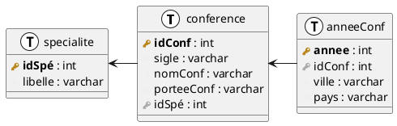

# Cours magistral 1

- Histoire des bases de données (du FBI à IBM)
- Introduction sur les bases de données relationnelles
  - Les contraintes
    - Les contraintes d'intégrité
    - Les contraintes implicites
- TD 1 (wtf)

## TD1

### Exercice 1

On va considérer 3 tables : `Conference`, `Specialite` et `AnneeConf` :

#### Question 1

> **Donner les super-clés des tables `Spécialité`, et `AnneeConf`.**

Les super-clés de `Specialite` sont :

- `idSpé` (car c'est la clé primaire)
- `idSpé` + `libelle`

Les super-clés de `AnneeConf` sont :

- `annee` et `idConf` (car c'est la clé primaire)
- `idConf`, `annee` et `ville`
- `idConf`, `annee`, `ville` et `pays`

#### Question 2

> **On va considérer que la base de donnée est remplie comme suit :**

> | idSpé | libelle |
> |-------|---------|
> | 0     | DB |

> | idConf | sigle | nomConf | porteeConf | idSpé |
> |--------|-------|---------|------------|-------|
> | 0 | BDA | BD annuelle | France | 0 |

> | idConf | annee | ville | pays |
> |--------|-------|-------|------|
> | 0 | 2022 | Clermont-Ferrand | France |

##### Question 2.1

> **Que se passe-t-il avec : `INSERT INTO Specialite VALUES (0, 'maths')` ?**

Il y a une erreur car la contrainte de clé primaire est violée par cette insertion.

##### Question 2.2

> **Que se passe-t-il avec : `INSERT INTO AnneConf VALUES (0, 2021, `Paris`, `France`)` ?**

La clé primaire n'est pas violée (la clé est `idConf` + `annee`). Donc l'insertion est possible.

On obtient donc :

> | idConf | annee | ville | pays |
> |--------|-------|-------|------|
> | 0 | 2022 | Clermont-Ferrand | France |
> | 0 | 2021 | Paris | France |

##### Question 2.3

> **Que se passe-t-il avec : `INSERT INTO AnneConf VALUES (1, 2022, `Sydney`, `Australie`)` ?**

L'insertion viole la clé étrangère de la table `AnneeConf` car il n'y a pas de `idConf` = 1 dans la table `Conference`.

##### Question 2.4

> **Que se passe-t-il avec : `INSERT INTO Conference VALUES (1, `VLDB`, `VLDB`, `mondiale`, 0)` ?**

Il n'y a pas de problème car la clé primaire n'est pas violée et la clé étrangère est présente dans la table `Specialite`.

On obtient donc :

> | idConf | sigle | nomConf | porteeConf | idSpé |
> |--------|-------|---------|------------|-------|
> | 0 | BDA | BD annuelle | France | 0 |
> | 1 | VLDB | VLDB | mondiale | 0 |

##### Question 2.5

> **Que se passe-t-il avec : `DELETE FROM Conference WHERE idConf = 0` ?**

La suppression est possible car la clé primaire n'est pas violée. Il existe bien une clé primaire avec `idConf` = 0.