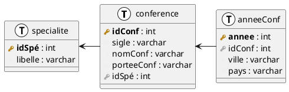

# Cours magistral 1

- Histoire des bases de données (du FBI à IBM)
- Introduction sur les bases de données relationnelles
  - Les contraintes
    - Les contraintes d'intégrité
    - Les contraintes implicites
- TD 1 (wtf)

## TD1

### Exercice 1

On va considérer 3 tables : `Conference`, `Specialite` et `AnneeConf` :



#### Question 1

> **Donner les super-clés des tables `Spécialité`, et `AnneeConf`.**

Les super-clés de `Specialite` sont :

- `idSpé` (car c'est la clé primaire)
- `idSpé` + `libelle`

Les super-clés de `AnneeConf` sont :

- `annee` et `idConf` (car c'est la clé primaire)
- `idConf`, `annee` et `ville`
- `idConf`, `annee`, `ville` et `pays`


#### Question 2

> **On va considérer que la base de donnée est remplie comme suit :**


> | idSpé | libelle |
> |-------|---------|
> | 0     | DB |


> | idConf | sigle | nomConf | porteeConf | idSpé |
> |--------|-------|---------|------------|-------|
> | 0 | BDA | BD annuelle | France | 0 |

> | idConf | annee | ville | pays |
> |--------|-------|-------|------|
> | 0 | 2022 | Clermont-Ferrand | France |

##### Question 2.1

> **Que se passe-t-il avec : `INSERT INTO Specialite VALUES (0, 'maths')` ?**

Il y a une erreur car la contrainte de clé primaire est violée par cette insertion.

##### Question 2.2

> **Que se passe-t-il avec : `INSERT INTO AnneConf VALUES (0, 2021, `Paris`, `France`)` ?**

La clé primaire n'est pas violée (la clé est `idConf` + `annee`). Donc l'insertion est possible.

On obtient donc :

> | idConf | annee | ville | pays |
> |--------|-------|-------|------|
> | 0 | 2022 | Clermont-Ferrand | France |
> | 0 | 2021 | Paris | France |

##### Question 2.3

> **Que se passe-t-il avec : `INSERT INTO AnneConf VALUES (1, 2022, `Sydney`, `Australie`)` ?**

L'insertion viole la clé étrangère de la table `AnneeConf` car il n'y a pas de `idConf` = 1 dans la table `Conference`.

##### Question 2.4

> **Que se passe-t-il avec : `INSERT INTO Conference VALUES (1, `VLDB`, `VLDB`, `mondiale`, 0)` ?**

Il n'y a pas de problème car la clé primaire n'est pas violée et la clé étrangère est présente dans la table `Specialite`.

On obtient donc :

> | idConf | sigle | nomConf | porteeConf | idSpé |
> |--------|-------|---------|------------|-------|
> | 0 | BDA | BD annuelle | France | 0 |
> | 1 | VLDB | VLDB | mondiale | 0 |

##### Question 2.5

> **Que se passe-t-il avec : `DELETE FROM Conference WHERE idConf = 0` ?**

La suppression est possible car la clé primaire n'est pas violée. Il existe bien une clé primaire avec `idConf` = 0.


# Cours Magistral 2

## TD2

### Exercice 1

Implémenter les fonctions suivantes :

- Le client 0 ajoute des carottes à son panier
- Le prix des pommes augmente de 1€
- Supprimer les carottes des produits disponibles

On se base des tables suivantes :

Somme :

| Client | Total |
|--------|-------|
| 0 | 10 |
| 1 | 5 |

Panier :

| Client | Produit |
|--------|---------|
| 0 | 0 |
| 0 | 1 |
| 1 | 0 |

Produit :

| Produit | Nom | Prix |
|---------|-----|------|
| 0 | pommes | 5 |
| 1 | poires | 5 |
| 2 | carottes | 3 |

#### Question 1

> **Le client 0 ajoute des carottes à son panier**

```sql
-- On ajoute les carottes au panier
INSERT INTO Panier VALUES (0, 2);

-- On récupère le prix des carottes
prixCarottes <- SELECT Prix FROM Produit WHERE Produit = 2;

-- On met à jour le total du client 0
UPDATE Somme SET Total = Total + prixCarottes WHERE Client = 0;
```

#### Question 2

> **Le prix des pommes augmente de 1€**

```sql
-- On met à jour le prix des pommes
UPDATE Produit SET Prix = Prix + 1 WHERE Produit = 0;

-- On récupère le prix des pommes
prixPommes <- SELECT Prix FROM Produit WHERE Produit = 0;

-- On met à jour le total de chaque client si il y a des pommes dans son panier
UPDATE Somme SET Total = Total + prixPommes WHERE Client IN (SELECT Client FROM Panier WHERE Produit = 0);
```

#### Question 3

> **Supprimer les carottes des produits disponibles**

```sql
-- On récupère le prix des carottes
prixCarottes <- SELECT Prix FROM Produit WHERE Produit = 2;

-- On met à jour le total de chaque client si il y a des carottes dans son panier
UPDATE Somme SET Total = Total - prixCarottes WHERE Client IN (SELECT Client FROM Panier WHERE Produit = 2);

-- On supprime les carottes du panier
DELETE FROM Panier WHERE Produit = 2;
-- On supprime les carottes des produits disponibles
DELETE FROM Produit WHERE Produit = 2;
```

Note : L'ordre est important dans les requêtes sinon il peut y avoir des erreurs soit d'execution soit de calcul.

