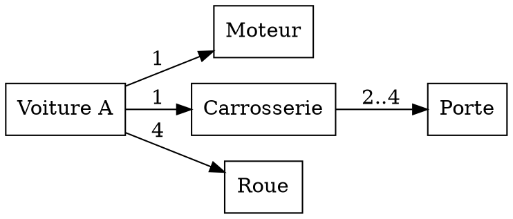
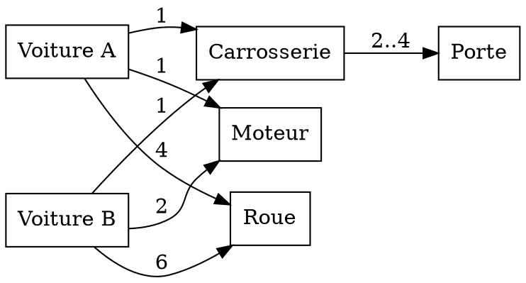
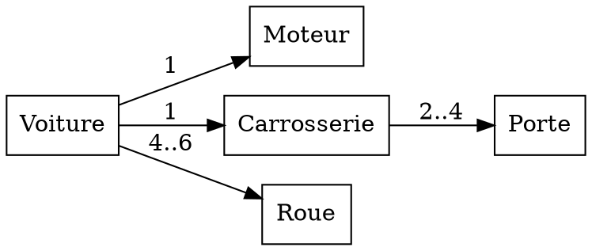

# TD2

## Exercice 1

### Question 1

<!-- Une voiture de type A est constituée d’un moteur, d’une carrosserie et de quatre roues. La carrosserie est constituée de portes, dont le nombre peut varier entre 2 et 4. 
Proposez un diagramme de classes pour les voitures A.
-->

### Question 2

<!-- Les voitures de type B sont constituées de deux moteurs (l’un à l’avant et l’autre à l’arrière), d’une carrosserie et de six roues. La carrosserie est constituée de portes, dont le nombre peut varier entre 2 et 4. -->

On fait un type abstrait `Voiture`.

