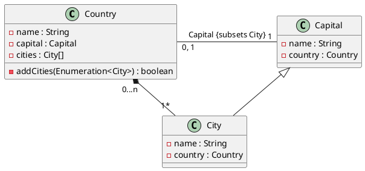
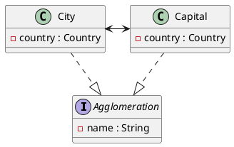
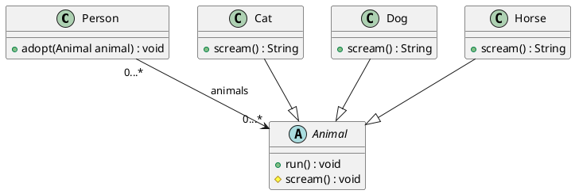
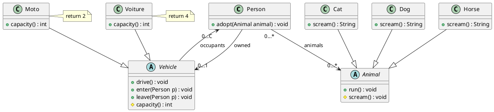

# Exercice 1 (Villes et pays)

## Question 1

<!-- 

On va faire un diagramme pour représenter les classe City, Capital, et Country

-> Un pays est constituté d'un ensemble de villes, mais d'exactement une capitale

-->




## Question 2

On implémente les classes :

```java
public class Country {
    private String name;
    private Capital capital;
    private ArrayList<City> cities;

    public Country(String name, Capital capital, City[] cities) {
        this.name = name;
        this.capital = capital;
        this.cities = cities;

        // On vérifie que toutes les villes ne sont pas une instance de Capital
        for (City city : cities) {
            if (city instanceof Capital) {
                throw new IllegalArgumentException("A country can't have a Capital as a city");
            }
        }

    }

    public String getName() {
        return name;
    }

    public Capital getCapital() {
        return capital;
    }

    public City getCity(int index) {
        return cities.get(index);
    }
}

public class Capital extends City {
    public Capital(String name, Country country) {
        super(name, country);
    }
}

public class City {
    private String name;
    private Country country;

    public City(String name, Country country) {
        this.name = name;
        this.country = country;
    }

    public String getName() {
        return name;
    }

    public Country getCountry() {
        return country;
    }
}
```


## Question 3

On va implémenter l'interface `Iterable<City>` pour la classe `Country`, et utiliser un `HashSet` pour stocker les villes. Mais il faut redéfinir un `Iterator` pour pouvoir itérer sur les villes.


```java
class Pays implements Iterable<City> {

    private final HashSet<City> cities = new HashSet<City>();
    private Capital capital;

    public Pays(Capital capital) {
        this.capital = capital;
        this.addCity(capital);
    }

    public boolean addCity(City city) {
        
        if (city instanceof Capital) {
            throw new IllegalArgumentException("A country can't have a Capital as a city");
        }

        return this.cities.add(requireNonNull(city));

    }

    @Override
    public Iterator<City> iterator() {
        return new Iterator<City>() {
            private final Iterator<City> it = cities.iterator();

            @Override
            public boolean hasNext() {
                return it.hasNext();
            }

            @Override
            public City next() {
                return it.next();
            }

            @Override
            public void remove() {
                throw new UnsupportedOperationException();
            }
        };
    }
    
}
```


Le prof propose de passer sur une interface `Agglomeration`, où `City` et `Capital` implémentent cette interface :




## Question 4

Le code final est :

```java
class Country implements Enumeration<City> {
    private String name;
    private Capital capital;
    private HashSet<City> cities;

    public Country(String name, Capital capital) {
        this.name = name;
        this.capital = capital;
        this.cities = new HashSet<City>();
        this.addCity(capital);
    }

    public addCity(City city) {
        if (city instanceof Capital) {
            throw new IllegalArgumentException("A country can't have a Capital as a city");
        }

        this.cities.add(city);
    }

    @Override
    public boolean hasMoreElements() {
        return cities.size() > 0;
    }

    @Override
    public City nextElement() {
        return cities.remove(0);
    }
}
```


# Exercice 2

## Question 1

> **Une personne peut posséder des animaux domestiques. Les animaux domestiques considérés ici sont des chiens, des chats ou des chevaux. Un animal peut courir et crier (on considère qu’ils courent tous de la même manière). Écrivez le diagramme de classes correspondant à cette spécification.**



## Question 2

> **Une personne peut posséder un véhicule. Le véhicule est en général une auto ou une moto. Un véhicule a une capacité (deux personne pour la moto, quatre personnes pour la voiture), peut avancer (à condition d’avoir au moins un occupant), et une personne peut y entrer (tant qu’il reste de la place) ou en sortir.**





## Question 3

```java
abstract class Vehicle {

    private final Set<Person> occupants = new HashSet<>();

    abstract int capacity();
    
    boolean isEmpty() {

        this.occupants.isEmpty();

    }

    void drive() {
        if (this.isEmpty()) {
            throw new IllegalStateException("Can't drive a vehicle without occupants");
        }

        // TODO
    }

    boolean leave(Personne p) {

        return this.occupants.remove(p);

    }

    boolean isFull() {

        return this.occupants.size() >= this.capacity();

    }

    boolean enter(Person p) {

        if (this.isFull()) {
            
            throw new IllegalStateException("Can't enter a full vehicle");

        }

        return this.occupants.add(p);

    }

}
```