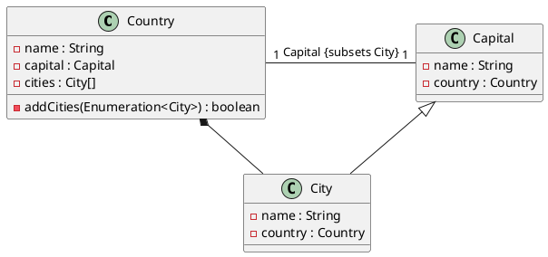
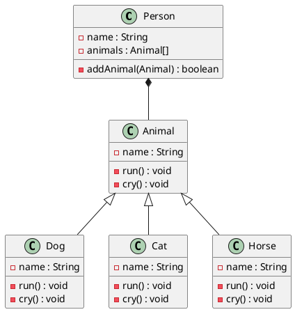
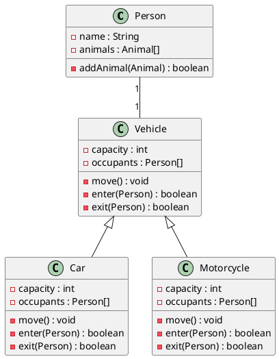

# Exercice 1 (Villes et pays)

## Question 1

<!-- 

On va faire un diagramme pour représenter les classe City, Capital, et Country

-> Un pays est constituté d'un ensemble de villes, mais d'exactement une capitale

-->




## Question 2

On implémente les classes :

```java
public class Country {
    private String name;
    private Capital capital;
    private ArrayList<City> cities;

    public Country(String name, Capital capital, City[] cities) {
        this.name = name;
        this.capital = capital;
        this.cities = cities;

        // On vérifie que toutes les villes ne sont pas une instance de Capital
        for (City city : cities) {
            if (city instanceof Capital) {
                throw new IllegalArgumentException("A country can't have a Capital as a city");
            }
        }

    }

    public String getName() {
        return name;
    }

    public Capital getCapital() {
        return capital;
    }

    public City getCity(int index) {
        return cities.get(index);
    }
}

public class Capital extends City {
    public Capital(String name, Country country) {
        super(name, country);
    }
}

public class City {
    private String name;
    private Country country;

    public City(String name, Country country) {
        this.name = name;
        this.country = country;
    }

    public String getName() {
        return name;
    }

    public Country getCountry() {
        return country;
    }
}
```


## Question 3

On fait en sorte qu'un pays n'aie qu'une seule capitale avec :

```java
// On vérifie que toutes les villes ne sont pas une instance de Capital
for (City city : cities) {
    if (city instanceof Capital) {
        throw new IllegalArgumentException("A country can't have a Capital as a city");
    }
}
```

## Question 4

Le code final est :

```java
class Country implements Enumeration<City> {
    private String name;
    private Capital capital;
    private HashSet<City> cities;

    public Country(String name, Capital capital) {
        this.name = name;
        this.capital = capital;
        this.cities = new HashSet<City>();
        this.addCity(capital);
    }

    public addCity(City city) {
        if (city instanceof Capital) {
            throw new IllegalArgumentException("A country can't have a Capital as a city");
        }

        this.cities.add(city);
    }

    @Override
    public boolean hasMoreElements() {
        return cities.size() > 0;
    }

    @Override
    public City nextElement() {
        return cities.remove(0);
    }
}
```

# Exercice 2 (Héritage Multiple)

## Question 1



## Question 2

<!-- Une personne peut posséder un véhicule. Le véhicule est en
général une auto ou une moto. Un véhicule a une capacité (deux personne pour la
moto, quatre personnes pour la voiture), peut avancer (à condition d’avoir au moins
un occupant), et une personne peut y entrer (tant qu’il reste de la place) ou en sortir. -->

