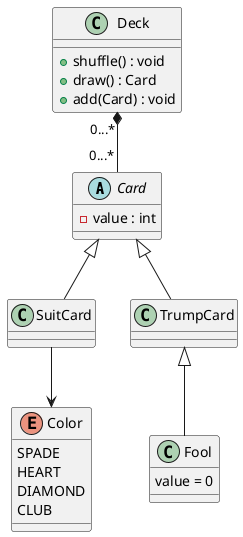

# Exercice 1

> **Exercice 1 (Jeu de tarot (initiation)) Le jeu de tarot se joue avec un jeu de cartes particulier. Au tarot, on différencie les cartes de couleurs (pique, cœur, carreau et trèfle) des atouts. Dans les cartes de couleurs, on trouve les valeurs de 1 à 10, ainsi que le valet, le cavalier, la dame et le roi. Dans les atouts, on trouve les valeurs de 1 à 21, ainsi que l’excuse.**

# Question 1

> **Représentez le diagramme de classes correspondant au jeu de tarot.**

On a le diagramme UML suivant :



## Question 2

> **Écrivez le code java correspondant aux classes des cartes et du paquet. À chaque tour, chaque joueur pose une carte à tour de rôle. Le joueur ayant posé la première carte impose la couleur à tous les autres. Celui qui remporte le pli est celui qui possè la carte la plus forte. La valeur des cartes est déterminée de la manière suivante :**
> — parmi toutes les cartes de la couleur demandée (par le premier joueur), la carte la plus forte est celle ayant la plus forte valeur (le roi remporte donc sur toutes les cartes de la couleur demandée) ;
> — toutes les cartes de couleur n’appartenant pas à la couleur demandée ont une valeur nulle et ne peuvent donc pas remporter ;
> — le plus fort des atouts joué remporte automatiquement, quelque soit la couleur demandée.
> Pour simplifier, on supposera que le premier joueur ne peut pas jouer un atout.**

```java
abstract class Card implements Comparable<Card> {
    
    private final int value;

    public Card(int value) {
        
        this.value = checkValue(value);

    }

    public int getValue() {
        return value;
    }

    private int checkValue(int value) {
        
        if (!this.isValueValid(value)) {
            throw new IllegalArgumentException("Invalid value");
        }

        return value;

    }

    protected abstract boolean isValueValid(int value);

    @Override
    public String toString() {
        return Integer.toString(value);
    }

    @Override
    public int compareTo(Card o) {
        return Integer.compare(this.value, o.value);
    }

    @Override
    public boolean equals(Object obj) {
        if (obj == null) {
            return false;
        }

        if (obj == this) {
            return true;
        }

        if (!(obj instanceof Card)) {
            return false;:
        }

        return this.compareTo((Card) obj) == 0;
    }

    @Override
    public int hashCode() {
        return Integer.hashCode(this.value);
    }

}

final class SuitCard extends Card implements Comparable<SuitCard> {

    enum Suit {
        SPADE,
        HEART,
        DIAMOND,
        CLUB
    }

    private final Suit suit;

    SuitCard(int value, Suit suit) {
        super(value);
        this.suit = suit;
    }

    @Override
    protected boolean isValueValid(int value) {
        return value >= 1 && value <= 10;
    }

    @Override
    public String toString() {
        return super.toString() + " " + suit;
    }

    @Override
    public int compareTo(SuitCard o) {
    
        if (o.isInstanceOf SuitCard) {
            return super.compareTo(o);
        }

        return -1 * o.compareTo(this);

    }

}