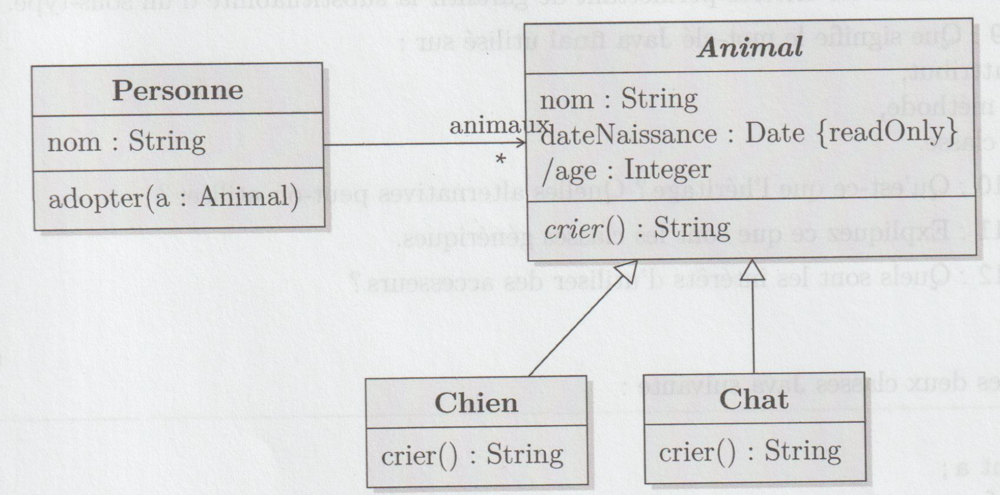
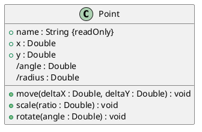
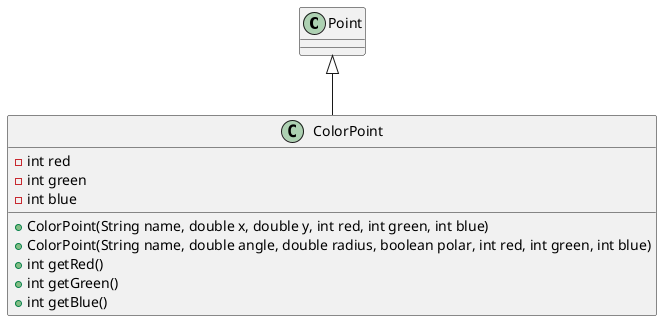
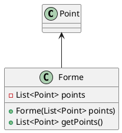

*Note : Il se peut que je ne soit pas sûr de certaines réponses, n'hésitez pas à me contacter si vous pensez que je me suis trompé. Je noterai les questions où je ne suis pas sûr d'une étoile.*

# Annale 2020-2021

## Exercice 1

### Question 1

> **En programmation orientée objet, qu'est-ce qu'un objet ?**

Un objet est une entité qui possède des attributs et des méthodes. Il peut être instancié et possède un état. Il peut être modifié par des méthodes.

On peut le voir comme une sorte de "boîte" qui contient des informations et des fonctions.

### Question 2

> **Expliquez le but et le fonctionnement des exceptions.**

Les exceptions sont des erreurs qui peuvent survenir lors de l'exécution d'un programme comme une division par zéro. Elles sont gérées par des blocs `try`/`catch` qui permettent de gérer les erreurs (pouvoir choisir un comportement en cas d'erreur).

### Question 3

> **Pourquoi faut-il toujours redéfinir hashCode (ou équivalent) quand on redéfini equals (ou équivalent) ?**

Si on redéfinit `equals`, on doit redéfinir `hashCode` pour que les deux méthodes soient cohérentes. En effet, si deux objets sont égaux (sans avoir la même référence), ils doivent avoir le même `hashCode`. 

Il en est de même si on redéfinit `compareTo`.

### Question 4

> **Quelle est la différence entre la redéfinition de méthodes et la surcharge?** 

La redéfinition de méthodes est une spécialisation d'une méthode d'une classe parente, par exemple un `Animal` qui redéfinit la méthode `manger` pour qu'elle soit plus spécifique à un `Chat`.

La surcharge est une méthode qui a le même nom mais qui a des paramètres différents. Par exemple, on peut avoir une méthode `manger` qui prend en paramètre un `Animal` et une autre qui prend en paramètre un `Nourriture`.

### Question 5

> **Quel est l'intérêt d'une machine virtuelle (dans le contexte de Java)?**

La machine virtuelle permet d'exécuter du code Java sur n'importe quel système d'exploitation. Par exemple, un programme Java écrit sur Windows peut être exécuté sur Linux, voire même sur un téléphone Android. 

Elle permet aussi une portabilité du code Java, car le code compilé est le même peu importe l'OS.

### Question 6

> **En Java, quelle est la différence entre l'opérateur == et la méthode equals?**

L'opérateur `==` compare les références des objets (leur emplacement en mémoire). La méthode `equals` compare les valeurs des objets (leur contenu) et peut-être redéfinie.

Donc deux `Etudiant` peuvent avoir la même valeur (même nom, prénom, etc.) mais ne pas être égaux (car ils ont des références différentes $\leftrightarrow$ ils ne sont pas de la même famille).

### Question 7*

*Note : je ne suis pas sûr.*

> **Pourquoi est-il préférable de ne dépendre que des interfaces?**

Cela permet de ne pas dépendre d'une implémentation particulière. Par exemple, on peut avoir une classe `Etudiant` qui dépend de l'interface `Personne` et qui peut donc être utilisée avec n'importe quelle implémentation de `Personne` (une classe `Etudiant` ou une classe `Professeur` par exemple).

### Question 8

> **Donner les critères permettant de garantir la substituabilité d'un sous-type.**

Liskov nous donne des critères pour garantir la substituabilité d'un sous-type :

- Une méthode de sous type renvoie un sous type
- Le sous type doit toujours appartenir à la famille du type parent
- Il donne moins de fonctionnalités que le type parent
- Garde les propriétés du type parent
- Conservation de la mutabilité et des états : si le type parent est mutable, le sous type doit l'être aussi. De même pour les états

### Question 9

> **Que signifie le mot-clé Java `final` utilisé sur : un attribut, une méthode, une classe.**

#### Attribut

Un attribut `final` ne peut pas être modifié après sa création. Il doit être initialisé dans le constructeur. C'est une constante.

#### Méthode

Une méthode `final` ne peut pas être redéfinie dans une classe fille. 

#### Classe

Une classe `final` ne peut pas être étendue (héritée). On peut dire que c'est une classe "scellée" ou "élémentaire".

### Question 10*

*Note : peut-être mieux formuler ?*

> **Qu'est-ce que l'héritage? Quelles alternatives peut-on utiliser?**

L'héritage est une relation entre deux classes où une classe fille hérite des attributs et méthodes de sa classe parente. Cela permet de réutiliser du code et d'organiser le code en classes plus petites.

On peut utiliser la délégation pour remplacer l'héritage. Par exemple, on peut avoir une classe `Etudiant` qui contient un attribut `Personne` et qui redéfinit les méthodes de `Personne` pour qu'elles soient plus spécifiques à un `Etudiant`.

### Question 11

> **Expliquez ce que sont les classes génériques.**

Les classes génériques sont des classes qui ne connaisse pas le type de leurs attributs avant l'instantiation. Au moment de l'instantiation et lors des sous-typages, on connaîtra le type des attributs. 

Cela permet de créer des classes qui peuvent être utilisées avec n'importe quel type d'attribut. Par exemple, on peut avoir une classe `Liste` qui contient une liste d'objets de type `T` et qui peut être utilisée avec n'importe quel type d'objet.

### Question 12

> **Quels sont les intérêts d'utiliser des accesseurs?**

Les accesseurs permettent de contrôler l'accès aux attributs d'une classe. Par exemple, on ne veut pas donner l'accès à la référence d'un étudiant, donc on peut créer un accesseur qui renvoie juste une information (le nom par exemple).

## Exercice 2

> **Soient les deux classes Java suivante:**

```java
class A {
    private int a; 
    
    A (int v) {
        a = v;
    }

    public int foo(A other) {
        return a + other.a;
    }

}

class B extends A {
    private int b;

    B (int v) {
        super(v);
    }

    @Override
    public int foo(B other) {
        return 42;
    }
}
```

> **Ce programme affiche une erreur à la compilation. Pourquoi?**

- La classe `B` hérite de la classe `A` mais la méthode `foo` n'a pas le même type de retour. La méthode `foo` de la classe `A` renvoie un `int` et la méthode `foo` de la classe `B` renvoie un `B`. Cela ne respecte pas la substitution de Liskov.
- Il en va de même pour la méthode `foo` de la classe `B` qui ne prend pas en paramètre un `A` mais un `B`.

## Exercice 3

> **Le programme Java suivant compile et s'exécute sans erreurs. Qu'affiche-t-il et pourquoi?**

```java
public class Indecision {
    public static void main(String[] args) {
        System.out.println(decision());
    }

    static String decision() {
        try {
            return "to be";
        } finally {
            return "not to be";
        }
    }
}
```

Lorsque la méthode `decision` est appelée, elle renvoie la chaîne de caractères `"to be"` car la méthode `decision` renvoie la valeur de retour de la dernière instruction exécutée. Cependant, la méthode `decision` contient un bloc `finally` qui est exécuté avant la fin de la méthode. Ce bloc `finally` contient une instruction `return` qui renvoie la chaîne de caractères `"not to be"`. C'est cette valeur qui est renvoyée par la méthode `decision`.

Donc le programme affiche `"not to be"`.

## Exercice 4

> **Soit le diagramme de classe conceptuel suivant :**



> **Donnez le code Java correspondant, en respectant les conventions du langage (attention, le diagramme n'est pas au niveau d'abstraction de l'implémentation). Vous pourrez utiliser la class `java.time.LocalDate` pour représenter la date. La méthode statique now de cette classe retourne la date courrante. Le détail de son utilisation n'est cependant pas important ici.**

<!-- 

Classes :

- Personne
  - A un nom
  - Peut adopter un animal
- Animal
  - Classe abstraite
  - A un nom
  - A une date de naissance
  - A un age calculé
  - Peut crier
- Un chien
  - Hérite d'animal
  - Redéfinit la méthode crier
- Un chat
  - Hérite d'animal
  - Redéfinit la méthode crier

-->

```java
import java.time.LocalDate;

class Personne {
    private String nom;
    private Animal animal;

    public Personne(String nom) {
        this.nom = nom;
    }

    public void adopter(Animal animal) {
        this.animal = animal;
    }
}

abstract class Animal {
    private String nom;
    private LocalDate dateNaissance;

    public Animal(String nom, LocalDate dateNaissance) {
        this.nom = nom;
        this.dateNaissance = dateNaissance;
    }

    public String getNom() {
        return nom;
    }

    public LocalDate getDateNaissance() {
        return dateNaissance;
    }

    public int getAge() {
        return LocalDate.now().getYear() - dateNaissance.getYear();
    }

    public abstract String crier();
}

class Chien extends Animal {
    public Chien(String nom, LocalDate dateNaissance) {
        super(nom, dateNaissance);
    }

    @Override
    public String crier() {
        return "Wouaf";
    }
}

class Chat extends Animal {
    public Chat(String nom, LocalDate dateNaissance) {
        super(nom, dateNaissance);
    }

    @Override
    public String crier() {
        return "Miaou";
    }
}


class Main {
    public static void main(String[] args) {
        Personne personne = new Personne("Jean");
        Animal chien = new Chien("Rex", LocalDate.of(2010, 1, 1));
        Animal chat = new Chat("Felix", LocalDate.of(2015, 1, 1));

        personne.adopter(chien);
        personne.adopter(chat);

        System.out.println(personne.animal.crier());
    }
}

```

# Annale 2018-2019 (1ère session)

## Exercice 1

### Question 1

> **En Java, qu'est-ce que le boxing et l'unboxing ? Pourquoi est-ce nécessaire ?**

Le boxing est le fait de transformer un type primitif en un objet : `int` -> `Integer`. L'unboxing est le fait de transformer un objet en un type primitif : `Integer` -> `int`.

Cela est nécessaire car les collections ne peuvent contenir que des objets et non des types primitifs. Par exemple, on ne peut pas mettre un `int` dans une `List<Integer>`, il faut donc le transformer en `Integer`.

### Question 2

> **Pourquoi est-il préférable de ne dépendre que des interfaces ?**

Cela permet de ne pas dépendre d'une implémentation particulière. Par exemple, on peut utiliser une `ArrayList` ou une `LinkedList` sans que cela ne change le code. 

Par exemple s'il y a une fonction `sort` qui prend en paramètre une `List` et qui trie cette liste, on peut utiliser un tri par insertion ou un tri par fusion sans que cela ne change le code de la fonction `sort` (du point de vue de l'utilisateur).

### Question 3

> **Donner les critères permettant de garantir la substituabilité d'un sous-type.**

Liskov nous donne des critères pour garantir la substituabilité d'un sous-type :

- Une méthode de sous type renvoie un sous type
- Le sous type doit toujours appartenir à la famille du type parent
- Il donne moins de fonctionnalités que le type parent
- Garde les propriétés du type parent
- Conservation de la mutabilité et des états : si le type parent est mutable, le sous type doit l'être aussi. De même pour les états

### Question 4

> **Quels sont les intérêts d'utiliser des accesseurs ?**

Les intérêts d'utiliser des accesseurs sont :

- On peut vérifier les valeurs des attributs
- On peut appliquer des traitements sur les attributs
- On n'a pas accès sur la référence de l'attribut, on ne renvoie que la valeur (pour garder l'encapsulation)

### Question 5

> **Quelles sont les caractéristiques principales du langage Java ?**

Les caractéristiques principales du langage Java sont :

- Orienté objet
- Typé statiquement
- Garbage collector
- Multiplateforme (grâce à la VM)
- Stable
- Ancien donc il a une grande communauté

### Question 6

> **Qu'est-ce que l'héritage? Quelles alternatives peut-on utiliser?**

L'héritage est une relation entre deux classes où une classe fille hérite des attributs et méthodes de sa classe parente. Cela permet de réutiliser du code et d'organiser le code en classes plus petites.

On peut utiliser la délégation pour remplacer l'héritage. Par exemple, on peut avoir une classe `Etudiant` qui contient un attribut `Personne` et qui redéfinit les méthodes de `Personne` pour qu'elles soient plus spécifiques à un `Etudiant`.

### Question 7

> **Expliquez la notion de sous-typage ? Quel en est l'intérêt ?**

Le sous-typage est une relation entre deux classes où une classe fille est un sous-type de sa classe parente. Cela permet de réutiliser du code et d'organiser le code en classes plus petites.

On peut ainsi faire des plus petites capsules de code qui sont plus facilement réutilisables : un `Véhicule` peut être un `Avion` ou un `Voiture` par exemple.

### Question 8

> **Qu'est-ce que le polymorphisme ? Quels en sont les types supportés par Java ?**

Le polymorphisme est la possibilité de voir un objet de plusieurs façons, comme appartenant à plusieurs types à la fois, ou pour une opération de s’appliquer à plusieurs types. Il existe différentes formes de polymorphisme (voir notamment transtypage, redéfinition, surcharge, type générique, sous-typage).

### Question 9

> **Que signifie le mot clé Java `final` utilisé sur :**

- un attribut : l'attribut ne peut pas être modifié dans la classe même ou dans une classe fille
- une méthode : la méthode ne peut pas être redéfinie dans une classe fille
- une classe : la classe ne peut pas être étendue : elle ne peut pas avoir de classe fille

### Question 10

> **Qu'est-ce que le JIT et à quoi sert-il ?**

Le JIT (Just In Time) est un compilateur qui compile le code Java en code machine à l'exécution. Il permet d'optimiser le code et de le rendre plus rapide. 

Si une méthode est appelée plusieurs fois, le JIT va compiler le code de cette méthode pour qu'il soit plus rapide à l'exécution.

## Exercice 2

> **Soient les deux classes Java suivantes :**

```java

```java
class A {
    private int a; 
    
    A (int v) {
        a = v;
    }

    public int foo(A other) {
        return a + other.a;
    }

}

class B extends A {

    B (int v) {
        super(v);
    }

    @Override
    public int foo(B other) {
        return 42;
    }

}
```

Le programme ne compile pas.

- La classe `B` hérite de la classe `A` mais la méthode `foo` n'a pas le même type de retour. La méthode `foo` de la classe `A` renvoie un `int` et la méthode `foo` de la classe `B` renvoie un `B`. Cela ne respecte pas la substitution de Liskov.
- Il en va de même pour la méthode `foo` de la classe `B` qui ne prend pas en paramètre un `A` mais un `B`.

## Exercice 3

**TOUT L'EXERCICE NE SERA PAS À L'EXAM CAR ON DOIT CODER**


> **On se propose ici de mettre en oeuvre une classe représentant un point géométrique, dont voici une représentation UML partielle :**



> **$x$ et $y$ représentent les coordonnées carthésiennes, et `angle` et `radius` représentent les coordonnées polaires. La méthode `rotate` permet de modifier l'angle, et la méthode `scale` multiplie $x$ et $y$ par le ratio donné. `move` permet de déplacer le point (en relatif).**

### Question 1

> **Donnez le code Java correspondant, en respectant les conventions du langage (attention le diagramme n'est pas au niveau d'abstraction de l'implémentation, il faudra donc ajouter les éléments nécessaires).**

```java
class Point {
    private String name;
    private double x;
    private double y;
    private double angle;
    private double radius;

    public Point(String name, double x, double y) {
        this.name = name;
        this.x = x;
        this.y = y;
        this.angle = Math.atan2(y, x);
        this.radius = Math.sqrt(x * x + y * y);
    }

    public String getName() {
        return name;
    }

    public double getX() {
        return x;
    }

    public double getY() {
        return y;
    }

    public double getAngle() {
        return angle;
    }

    public double getRadius() {
        return radius;
    }

    public void move(double deltaX, double deltaY) {
        this.x += deltaX;
        this.y += deltaY;
        this.angle = Math.atan2(y, x);
        this.radius = Math.sqrt(x * x + y * y);
    }

    public void scale(double ratio) {
        this.x *= ratio;
        this.y *= ratio;
        this.angle = Math.atan2(y, x);
        this.radius = Math.sqrt(x * x + y * y);
    }

    public void rotate(double angle) {
        this.angle += angle;
        this.x = radius * Math.cos(angle);
        this.y = radius * Math.sin(angle);
    }
}
```

### Question 2

> **On veut pouvoir créer un point en spécifiant soit ses coordonnées cartésiennes, soit ses coordonnées polaires. Il faudra donc ajouter les éléments nécessaires à la classe pour pouvoir faire cela.**

```java
class Point {
    private String name;
    private double x;
    private double y;
    private double angle;
    private double radius;

    public Point(String name, double x, double y) {
        this.name = name;
        this.x = x;
        this.y = y;
        this.angle = Math.atan2(y, x);
        this.radius = Math.sqrt(x * x + y * y);
    }

    public Point(String name, double angle, double radius, boolean polar) {
        this.name = name;
        this.angle = angle;
        this.radius = radius;
        this.x = radius * Math.cos(angle);
        this.y = radius * Math.sin(angle);
    }

    public String getName() {
        return name;
    }

    public double getX() {
        return x;
    }

    public double getY() {
        return y;
    }

    public double getAngle() {
        return angle;
    }

    public double getRadius() {
        return radius;
    }

    public void move(double deltaX, double deltaY) {
        this.x += deltaX;
        this.y += deltaY;
        this.angle = Math.atan2(y, x);
        this.radius = Math.sqrt(x * x + y * y);
    }

    public void scale(double ratio) {
        this.x *= ratio;
        this.y *= ratio;
        this.angle = Math.atan2(y, x);
        this.radius = Math.sqrt(x * x + y * y);
    }

    public void rotate(double angle) {
        this.angle += angle;
        this.x = radius * Math.cos(angle);
        this.y = radius * Math.sin(angle);
    }
}
```

### Question 3

> **On veut que deux points soient considérés égaux s'ils sont au même endroit. Comment faire ? Donnez le code Java correspondant.**

```java
class Point {
    private String name;
    private double x;
    private double y;
    private double angle;
    private double radius;

    public Point(String name, double x, double y) {
        this.name = name;
        this.x = x;
        this.y = y;
        this.angle = Math.atan2(y, x);
        this.radius = Math.sqrt(x * x + y * y);
    }

    public Point(String name, double angle, double radius, boolean polar) {
        this.name = name;
        this.angle = angle;
        this.radius = radius;
        this.x = radius * Math.cos(angle);
        this.y = radius * Math.sin(angle);
    }

    public String getName() {
        return name;
    }

    public double getX() {
        return x;
    }

    public double getY() {
        return y;
    }

    public double getAngle() {
        return angle;
    }

    public double getRadius() {
        return radius;
    }

    public void move(double deltaX, double deltaY) {
        this.x += deltaX;
        this.y += deltaY;
        this.angle = Math.atan2(y, x);
        this.radius = Math.sqrt(x * x + y * y);
    }

    public void scale(double ratio) {
        this.x *= ratio;
        this.y *= ratio;
        this.angle = Math.atan2(y, x);
        this.radius = Math.sqrt(x * x + y * y);
    }

    public void rotate(double angle) {
        this.angle += angle;
        this.x = radius * Math.cos(angle);
        this.y = radius * Math.sin(angle);
    }

    @Override
    public boolean equals(Object obj) {
        if (obj == null) {
            return false;
        }
        if (obj == this) {
            return true;
        }
        if (!(obj instanceof Point)) {
            return false;
        }
        Point other = (Point) obj;
        return this.x == other.x && this.y == other.y;
    }
}
```

On a rajouté `equals` qui compare les coordonnées cartésiennes des deux points.

### Question 4

> **On souhaite étendre cette classe en ajoutant de la couleur. Une couleur est représentée par trois valeurs entières dans $[0, 255]$ (rouge, vert et bleu). Donner le diagramme UML et le code correspondants (la classe `Point` doit rester inchangée).**



```java
class ColorPoint extends Point {
    private int red;
    private int green;
    private int blue;

    public ColorPoint(String name, double x, double y, int red, int green, int blue) {
        super(name, x, y);
        this.red = red;
        this.green = green;
        this.blue = blue;
    }

    public ColorPoint(String name, double angle, double radius, boolean polar, int red, int green, int blue) {
        super(name, angle, radius, polar);
        this.red = red;
        this.green = green;
        this.blue = blue;
    }

    public int getRed() {
        return red;
    }

    public int getGreen() {
        return green;
    }

    public int getBlue() {
        return blue;
    }
}
```

### Question 5

> **Une forme est un ensemble d'au moins deux points. Donnez le diagramme UML correspondant. Expliquez la mise en oeuvre (pas de code nécessaire).**



On a une classe `Forme` qui contient une liste de points. On peut donc créer une forme avec un seul point, mais c'est un peu bizarre.


### Question 6

> **Comment gérer l'égalité des points en prenant en compte les points colorés ?**

`instanceof` avec un point de la classe `ColorPoint` renverra `true` avec un point de la classe `Point` car c'est une sous-classe. On peut donc utiliser `instanceof` pour vérifier si un point est coloré ou non.


