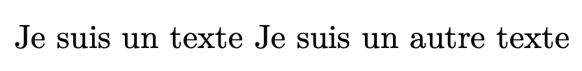
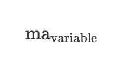
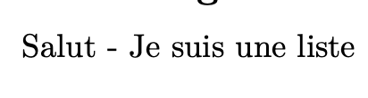
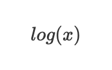
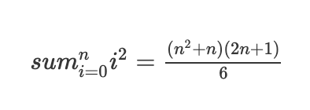

--- 
title: "Tips pour l'utilisation de pandoc"
date: Février 2023
author: VAN DE MERGHEL Robin
lang: fr
geometry: margin=1in
--- 


# Les principes de base

Pour un bon fonctionnement de pandoc et pour obtenir un rapport propre, il faut respecter quelques principes de base.

## Une bonne commande de compilation

Elle est longue mais complète, voici la commande de compilation que j'utilise personnellement :

```bash
pandoc -f markdown -t pdf --mathjax --table-of-contents -o "rapport.pdf" --listings -H ./listings-setup.tex --pdf-engine=xelatex "tonmarkdown.md"
```

**Note importante : il faut créer un fichier `listings-setup.tex`**. Vous pouvez le trouver dans le dossier `pandoc-data` de ce repo.

Ce dernier permet de rajouter du syntax highlighting dans les blocs de code.

## Ne pas faire de table des matières à la main

Pandoc est un outil génial, des choses comme la table des matières sont générées automatiquement en rajoutant `--toc` à la commande de compilation. 

Plutôt que de générer la table des matières à la main, il est préférable de laisser pandoc s'en occuper.

## Bien espacer le texte

Il est important de bien espacer le texte. En effet, si vous écrivez :

```latex
Je suis un texte
Je suis un autre texte
```

Pandoc va compiler en LaTeX, mais le LaTeX l'intéprétera comme un seul paragraphe. On obtiendra donc :



Pour éviter cela, il faut bien espacer le texte :

```latex
Je suis un texte

Je suis un autre texte
```

Que ce soit un titre, ou un paragraphe, **il faut toujours laisser une ligne vide entre chaque élément** pour éviter de se faire surprendre.

## Ne pas faire le titre principal à la main

Le titre principal est généré automatiquement par pandoc. Il est donc inutile de le faire à la main.

On préfère éviter de faire :

```latex
# Titre principal
```

On préfère plutôt mettre au début du fichier :

```latex
---
title: "Titre principal"
author: "Auteur"
date: [Date de création]
lang: fr
---
```

Ces lignes représentent les premières lignes de votre rapport. Elles sont appelées les *métadonnées*. Elles permettent de générer automatiquement le titre principal, l'auteur, la date de création, etc.

## Quand je peux faire des formules, je fais des formules

Pandoc permet d'écrire des formules LaTeX. C'est très pratique, et **il faut l'exploiter**.

On préfèrera largement une formule LaTeX plutôt que du texte :

Entre f(a,b), `f(a,b)` et $f(a,b)$, on préfère la dernière option.

Un moment où il ne faut pas utiliser de LaTeX est pour des fonctions qui se trouvent dans un code. On préfèrera alors utiliser le bloc de code :

```latex
`f(a,b)`
```

## Relire son rapport

C'est bête, mais entre le preview de Vscode par exemple et le rapport lui même, il y a des différences.

En effet, le preview de Vscode est un pandoc **HTML** et non un pandoc **PDF**. Il y a donc des différences (par exemple les retours à la ligne).

De plus il faut relire son code car on peut **oublier de mettre des mots dans des blocs de codes ou des formules**.

# Les erreurs classiques

Il y a des erreurs connues qui peuvent survenir lors de l'utilisation de pandoc. Une énumération pour en trouver l'origine.

## *Missing $ inserted.*

Lorsque vous avez une erreur du type :
```
! Missing $ inserted.
<inserted text> 
            $
l.4 ...
```

Plusieurs possibilités :

### En cas d'utilisation de formules LaTeX

Il est possible que vous ayez oublié de fermer une formule LaTeX. Par exemple, si vous avez écrit :

```latex
$x^2 % <--- oubli de la fermeture de la formule
```

### Dans l'absence de formules LaTeX

Dans ce cas, l'erreur peut provenir de texte à vous qui utilise des mots-clés LaTeX. Par exemple, si vous avez écrit :

```latex
ma_variable
```

L'underscore `_` est un mot-clé LaTeX qui permet d'afficher une partie de l'équation en dessous d'une autre.

Exemple :



Dans ce cas, il faut échapper le mot-clé en utilisant le caractère `\` :

```latex
ma\_variable
```


## *Undefined control sequence*

Lorsque vous avez une erreur du type :

```
! Undefined control sequence.
l.4 ...
```

Plusieurs possibilités :

### En cas d'utilisation de formules LaTeX

Il est possible que la formule LaTeX que vous avez écrite soit incorrecte. Par exemple, si vous avez écrit :

```latex
\racine{2}
```

La racine carrée n'est pas définie comme cela dans LaTeX. Il faut utiliser `\sqrt` à la place. 

La seule façon de résoudre cela est de regarder la documentation de LaTeX ou de relire attentivement la formule que vous avez écrite.

### Dans l'absence de formules LaTeX

Il est possible par exemple si dans votre rapport vous parliez de caractères spéciaux, que vous ayez écrit :

```latex
\n
```

`\n` permet de faire un retour à la ligne par exemple pour mon programme en `C`, mais LaTeX lui **comme ça commence par `\`**, il pense que c'est un mot-clé. 

Mais comme il ne le connait pas, il affiche une erreur.

Pour éviter cela, on a plusieurs possibilités :

- On peut échapper le mot-clé en utilisant le caractère `\` :

```latex
\\n % Comme on utilise deux fois le caractère `\`, le deuxième est interprété comme un caractère normal
```

- On peut utiliser un bloc de code (plus logique dans le cas présent) :

```latex
`\n`
```


# Bugs d'affichage

## Listes buguées lors de l'export

Il est possible que votre liste ressemble à cela :



*La liste ne s'affiche pas, et tout est aligné*


Comme vu avant, pour corriger cela, il suffit de rajouter un trou entre le texte avant la liste, et la liste elle-même. Par exemple :

Avant :

```latex
Je suis un texte
- Je suis une liste
```

Après :

```latex
Je suis un texte

- Je suis une liste
```

## Formule LaTeX buguée

Pour cette section, cela touche chaque formule mal affichée et non seulement $\log$ ou $\sum$.

Il est possible que votre formule LaTeX ressemble à cela :



*Texte en italique*

Ou encore :



*La somme n'est pas affichée*

Pour corriger cela, il suffit de rajouter `\` devant le mot-clé. Par exemple :

```latex
$\sum_{i=0}^n i^2 = \frac{(n^2+n)(2n+1)}{6}$
```

On obtient alors : $\sum_{i=0}^n i^2 = \frac{(n^2+n)(2n+1)}{6}$

On a cela car LaTeX a beaucoup de mots-clés qui commencent par `\`. Par exemple, `\sum` permet d'afficher une somme.

Mais si on écrit `sum` sans le `\`, LaTeX pense que c'est un mot normal, et donc l'affiche en italique.

**Il faut donc connaître au minimum les mots-clés de LaTeX pour éviter ce genre de problème, ou utiliser des extensions comme sur VSCode qui listent les formules.**

## Paragraphes bugués

Comme vu plus haut, il est possible que votre paragraphe ressemble à cela :


*Les deux paragraphes sont collés*

Pour corriger cela, il suffit de rajouter un trou entre les deux paragraphes. Par exemple :

Avant :

```latex
Je suis un texte
Je suis un autre texte
```

Après :

```latex
Je suis un texte

Je suis un autre texte
```
