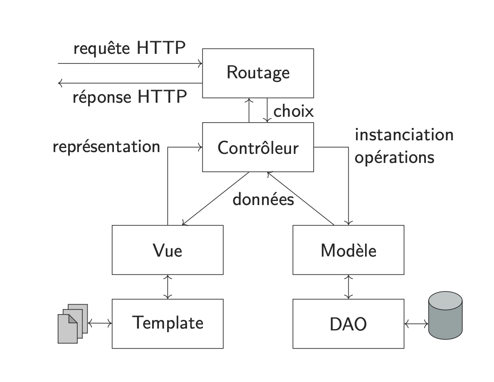

---
title: "Annale 2021-2022"
author: "VAN DE MERGHEL Robin"
date: "2023"
lang: fr
geometry: margin=2cm
--- 

# Exercice 1

## Question 1

> **Qu'est-ce qu'une ressource (dans le contexte du Web) ?**

Une ressource est un élément qui peut être identifié par une URI. Cela peut être un document, une image, un son, une vidéo, etc.

## Question 2

> **Que sont les cookies ? Comment fonctionnent-ils ? Quels problèmes posent-ils ?**

Les cookies sont des fichiers texte stockés sur l'on ordinateur du client. Ils permettent de stocker des informations sur le client comme sa connexion, ses préférences, etc. 

Ils posent des problèmes de sécurité car ils peuvent être utilisés pour voler des informations. Si on vole un cookie, on peut se connecter sur le compte de la personne qui l'a créé.

De plus, ils peuvent être utilisés pour suivre les utilisateurs sur internet : on peut voir ce qu'ils ont visité, ce qu'ils ont acheté, etc.

## Question 3

> **Expliquez le fonctionnement des sessions serveur.**

Une session serveur est une connexion entre un client et un serveur. Elle est créée quand le client se connecte au serveur et est détruite quand le client se déconnecte. Cela marche avec des cookies (cookies de session) qui sont stockés sur le client : ils contiennent un identifiant de session. Le serveur stocke les informations de la session dans une base de données.

## Question 4

> **Donnez les cinq catégories de code de status HTTP et leur signification.**

- 1xx : Information
- 2xx : Succès
- 3xx : Redirection
- 4xx : Erreur du client
- 5xx : Erreur du serveur

## Question 5

> **Quelles méthodes HTTP sont idempotentes ? Sans effet de bord ? Qu'est-ce que cela signifie ? En quoi cela est-il important ?**

Une méthode HTTP est idempotente si elle peut être exécutée plusieurs fois sans changer le résultat. Par exemple, la méthode GET est idempotente car elle ne modifie pas le serveur : que l'on fasse 1 requête ou 1000, le résultat sera le même.

Les méthodes idempotentes sont GET, PUT, DELETE et HEAD.

Cela est important car cela permet de faire des requêtes sans risque de changer le serveur. Par exemple, si on veut récupérer une ressource, on peut utiliser la méthode GET qui est idempotente. Si on utilise la méthode POST, on risque de modifier le serveur.

## Question 6

> **Donnez les différentes méthodes (ou verbes) du protocole HTTP et leur sémantique.**

- GET : Récupérer une ressource
- POST : Envoyer des données au serveur
- PUT : Envoyer des données au serveur et les stocker
- DELETE : Supprimer une ressource
- PATCH : Modifier une ressource
- HEAD : Récupérer les métadonnées d'une ressource
- OPTIONS : Récupérer les méthodes HTTP supportées par le serveur
- CONNECT : Créer un tunnel vers le serveur
- TRACE : Récupérer les requêtes envoyées au serveur

## Question 7

> **Quelles sont les principales propriétés du protocole HTTP ?**

Le protocole HTTP est :

- Sans état : le serveur ne garde pas d'information sur le client
- Interface uniforme : les requêtes et les réponses ont la même structure

*Je ne sais pas quoi dire de plus*

## Question 8

> **Qu'implique le fait pour HTTP d'être un protocole sans état ? En quoi cela est-ce souhaitable ?**

Comme le protocole HTTP est sans état, le serveur ne garde pas d'information sur le client. 

Cela permet de ne pas stocker d'informations sur le client et donc d'avoir toujours la même réponse. Par exemple, si on veut récupérer une ressource, on peut utiliser la méthode GET. 

Que ce soit la première fois ou la 1000ème fois, le serveur renverra la même réponse. 

# Exercice 2

## Question 1

> **Quel est le principe de fonctionnement des CGI ? Donner des alternatives et leur fonctionnement.**

Les CGI (Common Gateway Interface) sont des programmes qui sont exécutés par le serveur web. Ils permettent de générer des pages web dynamiques (par exemple, une page qui dépend de l'utilisateur).

Une alternative est les scripts PHP. Ils sont exécutés par le serveur web et permettent de générer des pages web dynamiques.

D'un côté les CGI sont séparés du code HTML, de l'autre côté les scripts PHP sont intégrés au code HTML.

## Question 2

> **Décrivez les différents éléments du modèle MVC, leurs rôles et les tâches effectuées par ceux-ci.**

Le modèle MVC est un modèle de développement logiciel qui permet de séparer les différentes parties d'une application web.

- Le modèle : il contient les données de l'application. Il est chargé de récupérer les données et de les stocker dans la base de données.
- La vue : elle contient le code HTML. Elle est chargée de récupérer les données du modèle et de les afficher.
- Le contrôleur : il est chargé de récupérer les données de la vue et de les envoyer au modèle.

## Question 3

> **Qu'est-ce que l'encodage d'un document ? Quels problèmes peuvent se poser dans la gestion de celui-ci ?**

L'encodage d'un document est le format dans lequel il est stocké. Par exemple, un document peut être stocké en UTF-8 ou en ISO-8859-1.

Cela peut poser des problèmes car les caractères peuvent être codés différemment selon l'encodage. Par exemple, le caractère "é" peut être codé par "é" ou par "é" selon l'encodage.

## Question 4

> **Que sont I18N et L10N ? Quels sont les problèmes posés, et comment le mettre en oeuvre ?**

*On a pas encore vu ça*

## Question 5

> **Quelle est la tâche du "renderer" (aussi appelé "formatteur") et pourquoi est-il nécessaire ?**

Le renderer est chargé d'intégrer les données dans le template. Il est nécessaire car il permet d'intégrer les données dans le template sans avoir à modifier le template.

## Question 6

> **Qu'est-ce qu'un système de template ? Quel est le but d'un tel système ?**

Un système de template est un système qui permet de générer des pages web dynamiques. Il permet de générer des pages web dynamiques sans avoir à modifier le code HTML.

Par exemple une page où l'on affiche le nom de l'utilisateur peut être générée avec un système de template.

## Question 7

> **Expliquez le fonctionnement de l'authentification via formulaire et cookie de session. Donnez les avantages et inconvénients de cette méthode.**

L'authentification via formulaire et cookie de session fonctionne comme ceci :

- Le client envoie une requête au serveur
- Le serveur renvoie une page web avec un formulaire d'authentification
- Le client envoie une requête avec les informations d'authentification
- Le serveur vérifie les informations d'authentification
- Si les informations sont correctes, le serveur renvoie une page web avec un cookie de session
- Le client envoie une requête avec le cookie de session
- La prochaine fois que le client envoie une requête, il envoie le cookie de session

*À revérifier*

