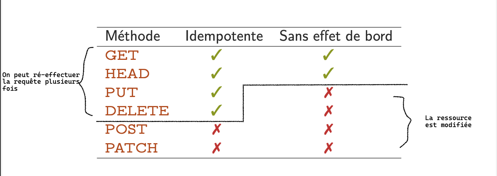
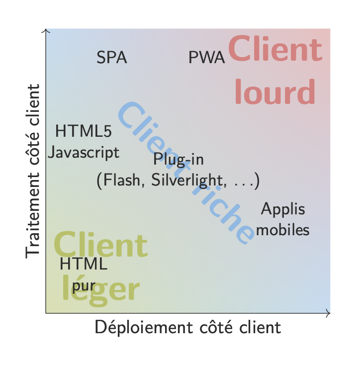

# Notions de base

## Différence entre **Net** et **Web**

### Le Net

Le **Net** (<=> Internet) est l'ensemble des connections entre les machines qui forme un imense réseau (Internet). Le **Web** c'est l'ensemble des ressources qui sont distribuées sur internet (sites, images, documents, ...). Le **Web** est fait pour être évolutif (on peut améliorer les façons de communiquer par exemple).

### Client vs Serveur

La différence **Client / Serveur** : Le client c'est toi, ton entourage, etc... Vous demandez aux serveurs des données (comme un site, ou la dernière vidéo de untel). Les serveurs c'est ce qui stock et traîte les données / requêtes des clients. Ex : les **Serveurs de Google** répondent à ta recherche
 
## Côté serveur

### Protocole

Un **protocole** (+ de la culture G, mais peut être utile pour rep), un ensemble de règles prédéfinies qui permettent à deux élément d'un réseaux (ex : Toi et ta box wifi) de discuter (quelques protocoles qu'on a vu en cours, à connaître de nom : **RSS, TCP, IP, HTTP(s)**)

### Site web

Un **Site Web** n'est *pas* une machine. Si je reprends google en exemple, google n'a pas que une machine pour leur site. Donc un site c'est **l'ensemble des ressources** (page HTML, CSS, images, documents PDF, ...)

### Deux types de serveurs : statiques, et dynamiques

Ajout sur les **Serveurs** : Le **Serveur** va aussi gérer les ressources (supprimer, créer, envoyer, ...), et on va distinguer : **Serveurs statiques** (page statique, genre présentation d'une personne), et **Serveurs dynamiques** (avec page de connection, calculs par du javascript, ...)

### Le cache

Le **Cache** est une méthode en informatique super utile pour accélérer les choses. Le **Cache** c'est un stockage temporaire des données (ex : les images d'un site web). Le **Cache** permet de ne pas avoir à télécharger les données à chaque fois, et donc d'accélérer le chargement des pages.

Il permet aussi si le serveur ne fonctionne plus, de pouvoir quand même afficher les données (ex : si le serveur de google tombe, on peut quand même afficher certaines pages de google).

### Le Proxy

Le **Proxy** se trouve entre le **Client** et le **Serveur** du côté du **Client**. Il permet de faire des choses comme :

- **Cacher** (not hide, to cache) les données (comme le **Cache**)
- **Chiffrer** les données (pour les protéger)
- **Filtrer** les données (pour les protéger, exemple : les collèges et lycées qui bloquent certains sites)
- **Accélérer** les données (pour les accélérer, exemple : les serveurs de google qui sont répartis dans le monde entier)

### Le Reverse Proxy

Le **Reverse Proxy** est un **Proxy** qui se trouve entre le **Client** et le **Serveur**, mais cette fois-ci, du côté du **Serveur**. Il permet de faire des choses comme :

- **Relayer** les données (pour les accélérer, exemple : les serveurs de google qui sont répartis dans le monde entier)
- **Chiffrer** les données (pour les protéger)

### CDN (Content Delivery Network)

Le **CDN** (Content Delivery Network) est un **Reverse Proxy** qui permet de faire des choses comme :

- **Mirrorring** (copie) des données (pour sécuriser les données, exemple : les serveurs de google qui sont répartis dans le monde entier, si un serveur tombe, on peut quand même afficher les données)
- **Accélérer** les données (il y a des serveurs procches de toi, donc plus rapide)

### Hypermédia

L'**Hypermédia** c'est un ensemble de données qui sont liées entre elles. Ex : un site web, un document PDF, ... 

Ils ont une adresse : **URI** (Uniform Resource Identifier) qui permet de les identifier.

### URI

L'**URI** (Uniform Resource Identifier) c'est l'identifiant d'une ressource. Il y a deux types d'**URI** :

- **URL** (Uniform Resource Locator) : l'adresse d'une ressource (ex : https://google.com)
- **URN** (Uniform Resource Name) : le nom d'une ressource (ex : urn:isbn:0451450523)

Un **URI** n'est pas clair : c'est le serveur qui lui donne un sens. Ex : `http://youtube.com/watch?v=j3VzaBcoDAI` c'est pas clair pour un humain, mais le serveur va comprendre que c'est une vidéo youtube qui a pour nom `XXXX`...

### DNS (Domain Name System)

Le **DNS** (Domain Name System) est un service qui permet de convertir un **URI** en une adresse IP (ex : `google.com` => `142.250.201.164`). C'est un service qui est ultra important, car sans ça, on ne pourrait pas accéder aux sites web facilement (tu devrais apprendre les adresses IP par coeur).

### Protocole HTTP

#### Présentation générale

Le **Protocole HTTP** (HyperText Transfer Protocol) est un protocole qui permet de communiquer entre un **Client** et un **Serveur**.

Comme tout les protocoles, il y a la même composition :

- Le **schéma** (ex : `http`, `https`, `ftp`, ...), c'est le nom du protocole
- Le **hôte** (ex : `google.com`, `github.com`, ...), c'est l'adresse du serveur
- Le **port** (ex : `80`, `443`, `21`, ...), c'est le port du serveur
- Le **chemin** (ex : `/`, `/search`, `/user`, ...), c'est le chemin de la ressource
- Les **paramètres** (ex : `?q=hello`, `?id=1`, ...), c'est les paramètres de la requête
- Les **fragments** (ex : `#hello`, `#world`, ...), c'est les fragments de la requête

Exemple d'**URI** :

- `http://google.com`
- `https://google.com/search?q=hello`

Le protocol HTTP est divisé en trois parties :

- **start-line** : la première ligne de la requête (ex : `GET / HTTP/1.1`), permet d'identifier la version du protocole, le type de requête, et le chemin de la ressource
- **headers** : les lignes suivantes (ex : `Host: google.com`), permettent d'envoyer des informations supplémentaires
- **body** : le corps de la requête (ex : `q=hello`), permet d'envoyer des données supplémentaires

#### Idempotence

L'**Idempotence** c'est la capacité d'un protocole à être répété sans changer le résultat. Ex : `GET` est idempotent, `POST` non.

En reformulant, si je fais 300 fois la même requête `GET`, le résultat sera le même. Si je fais 300 fois la même requête `POST`, le résultat sera différent.

#### Effet de bord

L'**Effet de bord** c'est la capacité d'un protocole à modifier le serveur. Ex : `GET` n'a pas d'**Effet de bord**, `POST` oui.

Si je fais une requête `GET`, le serveur ne va pas changer. Si je fais une requête `POST`, le serveur va changer (créer un utilisateur, ...).

#### Les erreurs

Les erreurs HTTP sont des codes qui permettent de savoir si la requête a fonctionné ou non. Ex : `200` c'est que la requête a fonctionné, `404` c'est que la ressource n'a pas été trouvée.

Il y a 5 catégories d'erreurs :

- **1xx** : Information
- **2xx** : Succès
- **3xx** : Redirection
- **4xx** : Erreur du client
- **5xx** : Erreur du serveur

## Côté client

### Un agent

Un **Agent** c'est ce qui permet à un **Client** d'intéragir avec le serveur : navigateurs web (Chrome, firefox, ...), robots (pour référencer les sites par exemple), agrégateurs (des outils pour écouter les protocoles)

### Clients lourds, légers, riches

